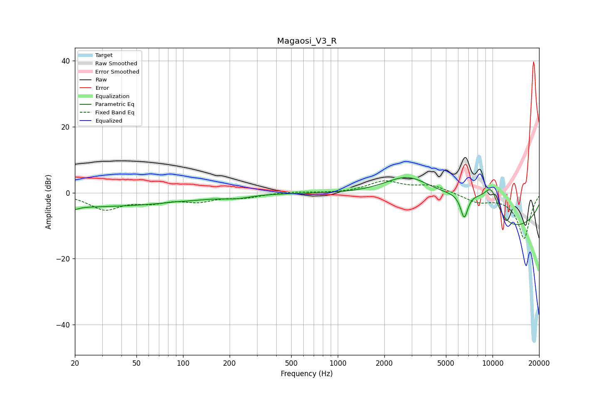

# Magaosi_V3_R
See [usage instructions](https://github.com/jaakkopasanen/AutoEq#usage) for more options and info.

### Parametric EQs
Apply preamp of -4.7 dB when using parametric equalizer.

|   # | Type    |   Fc (Hz) |    Q |   Gain (dB) |
|-----|---------|-----------|------|-------------|
|   1 | Peaking |        20 | 5.37 |        -0.8 |
|   2 | Peaking |        21 | 0.19 |        -4.3 |
|   3 | Peaking |        87 | 5.33 |         0.1 |
|   4 | Peaking |       124 | 1.02 |        -0.2 |
|   5 | Peaking |       223 | 1.71 |        -0.9 |
|   6 | Peaking |      2849 | 0.79 |         8.7 |
|   7 | Peaking |      6564 | 5.48 |        -7.7 |
|   8 | Peaking |      7394 | 0.65 |        12.3 |
|   9 | Peaking |      9803 | 2.29 |         8.5 |
|  10 | Peaking |     10000 | 0.3  |       -18   |

### Fixed Band EQs
When using fixed band (also called graphic) equalizer, apply preamp of **-3.7 dB** (if available) and set gains manually with these parameters.

|   # | Type    |   Fc (Hz) |    Q |   Gain (dB) |
|-----|---------|-----------|------|-------------|
|   1 | Peaking |        31 | 1.41 |        -4.8 |
|   2 | Peaking |        62 | 1.41 |        -2.3 |
|   3 | Peaking |       125 | 1.41 |        -2.3 |
|   4 | Peaking |       250 | 1.41 |        -1.3 |
|   5 | Peaking |       500 | 1.41 |         0.3 |
|   6 | Peaking |      1000 | 1.41 |        -0.2 |
|   7 | Peaking |      2000 | 1.41 |         3.4 |
|   8 | Peaking |      4000 | 1.41 |         2.2 |
|   9 | Peaking |      8000 | 1.41 |        -2.5 |
|  10 | Peaking |     16000 | 1.41 |       -13.9 |

### Graphs

