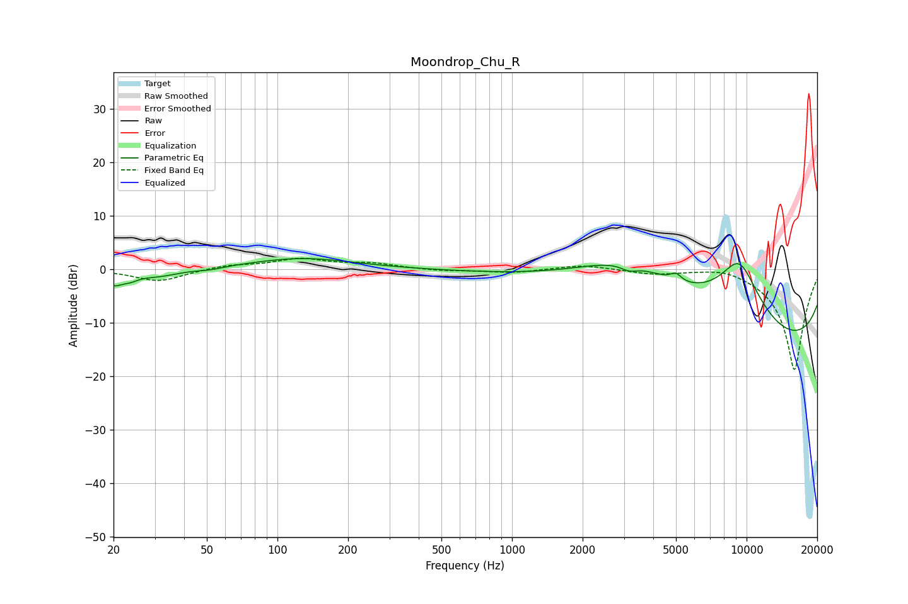

# Moondrop_Chu_R
See [usage instructions](https://github.com/jaakkopasanen/AutoEq#usage) for more options and info.

### Parametric EQs
Apply preamp of -2.1 dB when using parametric equalizer.

|   # | Type    |   Fc (Hz) |    Q |   Gain (dB) |
|-----|---------|-----------|------|-------------|
|   1 | Peaking |        20 | 4.03 |        -2.3 |
|   2 | Peaking |        23 | 3.76 |        -1.1 |
|   3 | Peaking |        31 | 1.53 |        -1.3 |
|   4 | Peaking |        52 | 2.44 |        -0.4 |
|   5 | Peaking |       128 | 0.65 |         2.1 |
|   6 | Peaking |      3155 | 3.84 |        -1.1 |
|   7 | Peaking |      3166 | 0.49 |        11.4 |
|   8 | Peaking |      4993 | 6    |         1.4 |
|   9 | Peaking |      9304 | 0.98 |        16.6 |
|  10 | Peaking |      9772 | 0.18 |       -19.3 |

### Fixed Band EQs
When using fixed band (also called graphic) equalizer, apply preamp of **-2.1 dB** (if available) and set gains manually with these parameters.

|   # | Type    |   Fc (Hz) |    Q |   Gain (dB) |
|-----|---------|-----------|------|-------------|
|   1 | Peaking |        31 | 1.41 |        -2.3 |
|   2 | Peaking |        62 | 1.41 |         0.7 |
|   3 | Peaking |       125 | 1.41 |         1.8 |
|   4 | Peaking |       250 | 1.41 |         1   |
|   5 | Peaking |       500 | 1.41 |        -0.3 |
|   6 | Peaking |      1000 | 1.41 |        -0.7 |
|   7 | Peaking |      2000 | 1.41 |         0.9 |
|   8 | Peaking |      4000 | 1.41 |        -0.8 |
|   9 | Peaking |      8000 | 1.41 |         0.9 |
|  10 | Peaking |     16000 | 1.41 |       -19   |

### Graphs

