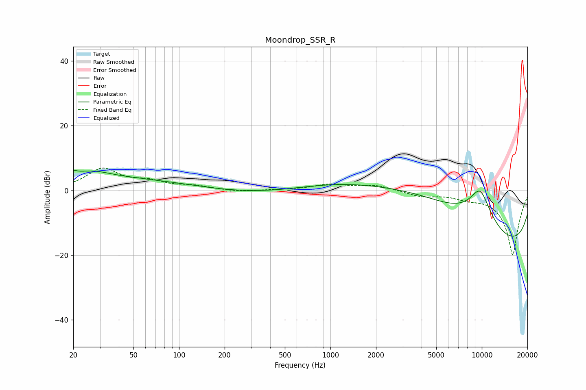

# Moondrop_SSR_R
See [usage instructions](https://github.com/jaakkopasanen/AutoEq#usage) for more options and info.

### Parametric EQs
Apply preamp of -6.3 dB when using parametric equalizer.

|   # | Type    |   Fc (Hz) |    Q |   Gain (dB) |
|-----|---------|-----------|------|-------------|
|   1 | Peaking |        20 | 4.92 |         1.8 |
|   2 | Peaking |        21 | 5.66 |        -0.4 |
|   3 | Peaking |        26 | 0.83 |         5.2 |
|   4 | Peaking |        51 | 1.55 |         0.4 |
|   5 | Peaking |        79 | 0.57 |         2   |
|   6 | Peaking |       372 | 0.48 |        -1.3 |
|   7 | Peaking |      4158 | 0.28 |        14.8 |
|   8 | Peaking |      9743 | 0.98 |        19.7 |
|   9 | Peaking |     10000 | 0.21 |       -10.4 |
|  10 | Peaking |     10000 | 0.24 |       -19.4 |

### Fixed Band EQs
When using fixed band (also called graphic) equalizer, apply preamp of **-7.0 dB** (if available) and set gains manually with these parameters.

|   # | Type    |   Fc (Hz) |    Q |   Gain (dB) |
|-----|---------|-----------|------|-------------|
|   1 | Peaking |        31 | 1.41 |         6.5 |
|   2 | Peaking |        62 | 1.41 |         2.3 |
|   3 | Peaking |       125 | 1.41 |         1.2 |
|   4 | Peaking |       250 | 1.41 |        -0.5 |
|   5 | Peaking |       500 | 1.41 |         0.1 |
|   6 | Peaking |      1000 | 1.41 |         1.8 |
|   7 | Peaking |      2000 | 1.41 |         1.6 |
|   8 | Peaking |      4000 | 1.41 |        -1.7 |
|   9 | Peaking |      8000 | 1.41 |        -1.5 |
|  10 | Peaking |     16000 | 1.41 |       -20   |

### Graphs

