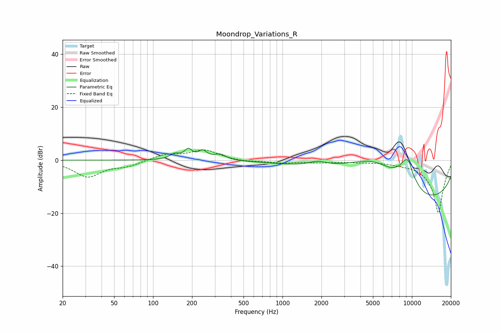

# Moondrop_Variations_R
See [usage instructions](https://github.com/jaakkopasanen/AutoEq#usage) for more options and info.

### Parametric EQs
Apply preamp of -4.6 dB when using parametric equalizer.

|   # | Type    |   Fc (Hz) |    Q |   Gain (dB) |
|-----|---------|-----------|------|-------------|
|   1 | Peaking |       147 | 3.75 |         2   |
|   2 | Peaking |       187 | 4.74 |         3.5 |
|   3 | Peaking |       242 | 4.22 |         3   |
|   4 | Peaking |       329 | 3.16 |         2.1 |
|   5 | Peaking |      1868 | 2.24 |         1.6 |
|   6 | Peaking |      5106 | 0.52 |        13.8 |
|   7 | Peaking |      9067 | 1.94 |         9.4 |
|   8 | Peaking |      9739 | 3.64 |         4.6 |
|   9 | Peaking |     10000 | 0.22 |       -20   |
|  10 | Peaking |     10000 | 5.43 |        -2.6 |

### Fixed Band EQs
When using fixed band (also called graphic) equalizer, apply preamp of **-4.0 dB** (if available) and set gains manually with these parameters.

|   # | Type    |   Fc (Hz) |    Q |   Gain (dB) |
|-----|---------|-----------|------|-------------|
|   1 | Peaking |        31 | 1.41 |        -6.1 |
|   2 | Peaking |        62 | 1.41 |        -1.9 |
|   3 | Peaking |       125 | 1.41 |         2.1 |
|   4 | Peaking |       250 | 1.41 |         3.8 |
|   5 | Peaking |       500 | 1.41 |        -0.6 |
|   6 | Peaking |      1000 | 1.41 |        -1   |
|   7 | Peaking |      2000 | 1.41 |        -0.7 |
|   8 | Peaking |      4000 | 1.41 |        -0.5 |
|   9 | Peaking |      8000 | 1.41 |        -0.6 |
|  10 | Peaking |     16000 | 1.41 |       -20   |

### Graphs

