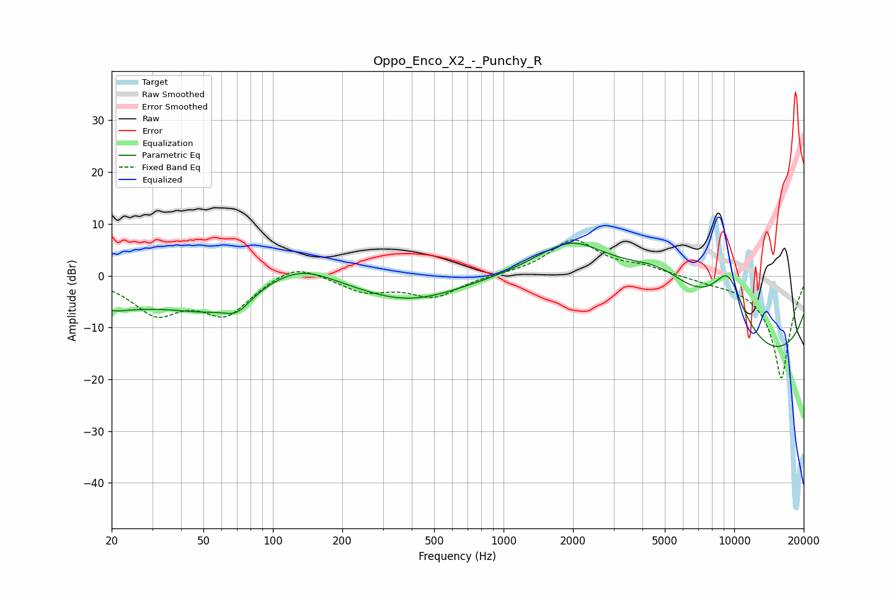

# Oppo_Enco_X2_-_Punchy_R
See [usage instructions](https://github.com/jaakkopasanen/AutoEq#usage) for more options and info.

### Parametric EQs
Apply preamp of -6.4 dB when using parametric equalizer.

|   # | Type    |   Fc (Hz) |    Q |   Gain (dB) |
|-----|---------|-----------|------|-------------|
|   1 | Peaking |        20 | 2.9  |        -1.3 |
|   2 | Peaking |        22 | 0.8  |        -4.1 |
|   3 | Peaking |        51 | 0.77 |        -5.3 |
|   4 | Peaking |        70 | 2.42 |        -3   |
|   5 | Peaking |       131 | 0.98 |         3.7 |
|   6 | Peaking |       382 | 0.62 |        -4.8 |
|   7 | Peaking |      1979 | 0.69 |        11.6 |
|   8 | Peaking |      4742 | 0.66 |        11.4 |
|   9 | Peaking |      9394 | 1.39 |        14   |
|  10 | Peaking |     10000 | 0.18 |       -20   |

### Fixed Band EQs
When using fixed band (also called graphic) equalizer, apply preamp of **-7.0 dB** (if available) and set gains manually with these parameters.

|   # | Type    |   Fc (Hz) |    Q |   Gain (dB) |
|-----|---------|-----------|------|-------------|
|   1 | Peaking |        31 | 1.41 |        -6.7 |
|   2 | Peaking |        62 | 1.41 |        -7.1 |
|   3 | Peaking |       125 | 1.41 |         3   |
|   4 | Peaking |       250 | 1.41 |        -2.9 |
|   5 | Peaking |       500 | 1.41 |        -4   |
|   6 | Peaking |      1000 | 1.41 |         0.1 |
|   7 | Peaking |      2000 | 1.41 |         6.9 |
|   8 | Peaking |      4000 | 1.41 |         1.5 |
|   9 | Peaking |      8000 | 1.41 |        -0.6 |
|  10 | Peaking |     16000 | 1.41 |       -20   |

### Graphs

