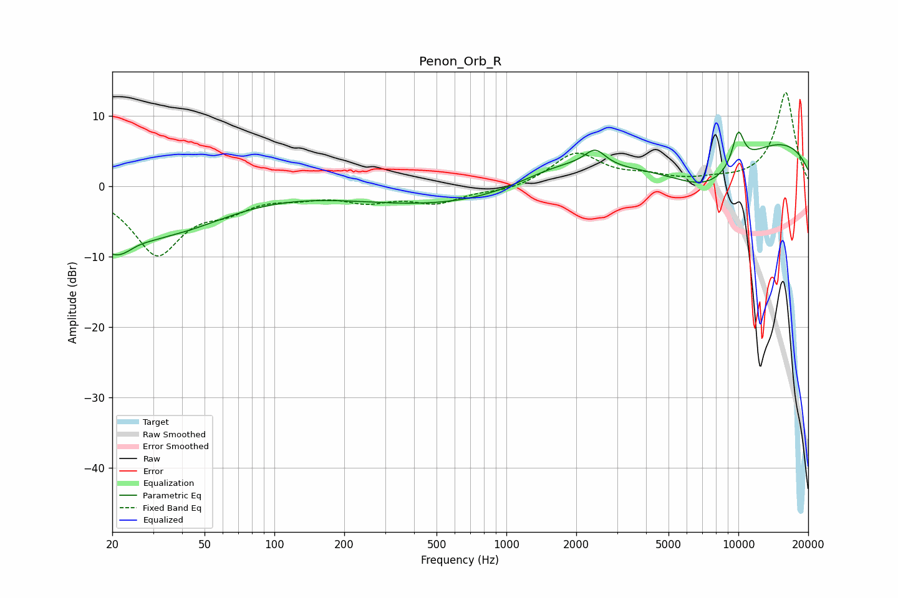

# Penon_Orb_R
See [usage instructions](https://github.com/jaakkopasanen/AutoEq#usage) for more options and info.

### Parametric EQs
Apply preamp of -7.8 dB when using parametric equalizer.

|   # | Type    |   Fc (Hz) |    Q |   Gain (dB) |
|-----|---------|-----------|------|-------------|
|   1 | Peaking |        21 | 1.18 |        -7.5 |
|   2 | Peaking |        25 | 2.46 |         0.8 |
|   3 | Peaking |        40 | 0.6  |        -4.5 |
|   4 | Peaking |      1138 | 0.19 |        -3.6 |
|   5 | Peaking |      1703 | 0.7  |         3.9 |
|   6 | Peaking |      2414 | 3.15 |         2.3 |
|   7 | Peaking |      7399 | 0.72 |        -6.7 |
|   8 | Peaking |      9927 | 4.04 |         1.4 |
|   9 | Peaking |     10000 | 4.9  |         3.5 |
|  10 | Peaking |     10000 | 0.21 |         8.3 |

### Fixed Band EQs
When using fixed band (also called graphic) equalizer, apply preamp of **-13.4 dB** (if available) and set gains manually with these parameters.

|   # | Type    |   Fc (Hz) |    Q |   Gain (dB) |
|-----|---------|-----------|------|-------------|
|   1 | Peaking |        31 | 1.41 |        -9.4 |
|   2 | Peaking |        62 | 1.41 |        -2.4 |
|   3 | Peaking |       125 | 1.41 |        -1.1 |
|   4 | Peaking |       250 | 1.41 |        -1.8 |
|   5 | Peaking |       500 | 1.41 |        -2.1 |
|   6 | Peaking |      1000 | 1.41 |        -0.7 |
|   7 | Peaking |      2000 | 1.41 |         4.7 |
|   8 | Peaking |      4000 | 1.41 |         1.1 |
|   9 | Peaking |      8000 | 1.41 |         0.5 |
|  10 | Peaking |     16000 | 1.41 |        13.4 |

### Graphs

