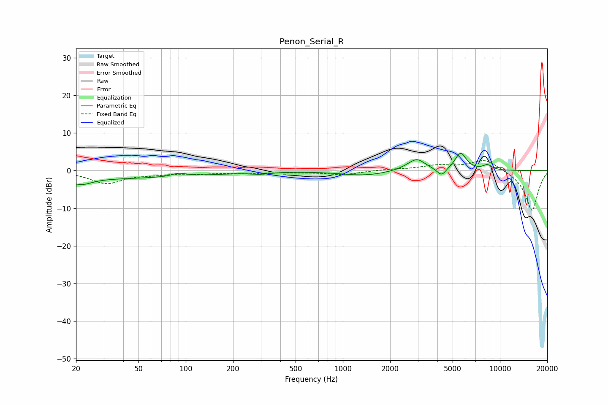

# Penon_Serial_R
See [usage instructions](https://github.com/jaakkopasanen/AutoEq#usage) for more options and info.

### Parametric EQs
Apply preamp of -4.7 dB when using parametric equalizer.

|   # | Type    |   Fc (Hz) |    Q |   Gain (dB) |
|-----|---------|-----------|------|-------------|
|   1 | Peaking |        21 | 2.1  |        -1.8 |
|   2 | Peaking |        33 | 0.21 |        -2   |
|   3 | Peaking |        91 | 3.07 |         0.9 |
|   4 | Peaking |       300 | 2.34 |        -0.5 |
|   5 | Peaking |      1376 | 0.92 |        -1.3 |
|   6 | Peaking |      2709 | 1.77 |         0.8 |
|   7 | Peaking |      2967 | 2.74 |         2.6 |
|   8 | Peaking |      4252 | 4.83 |        -2.2 |
|   9 | Peaking |      5618 | 3.81 |         4.6 |
|  10 | Peaking |      8325 | 4.63 |         1.3 |

### Fixed Band EQs
When using fixed band (also called graphic) equalizer, apply preamp of **-2.8 dB** (if available) and set gains manually with these parameters.

|   # | Type    |   Fc (Hz) |    Q |   Gain (dB) |
|-----|---------|-----------|------|-------------|
|   1 | Peaking |        31 | 1.41 |        -3.3 |
|   2 | Peaking |        62 | 1.41 |        -0.7 |
|   3 | Peaking |       125 | 1.41 |        -0.6 |
|   4 | Peaking |       250 | 1.41 |        -0.6 |
|   5 | Peaking |       500 | 1.41 |        -0.3 |
|   6 | Peaking |      1000 | 1.41 |        -1   |
|   7 | Peaking |      2000 | 1.41 |         0.3 |
|   8 | Peaking |      4000 | 1.41 |         1.2 |
|   9 | Peaking |      8000 | 1.41 |         3.1 |
|  10 | Peaking |     16000 | 1.41 |       -10.7 |

### Graphs

