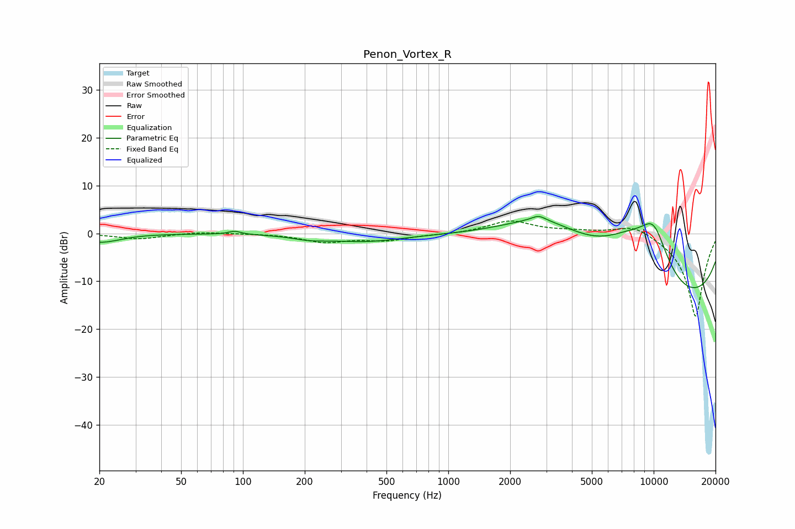

# Penon_Vortex_R
See [usage instructions](https://github.com/jaakkopasanen/AutoEq#usage) for more options and info.

### Parametric EQs
Apply preamp of -3.6 dB when using parametric equalizer.

|   # | Type    |   Fc (Hz) |    Q |   Gain (dB) |
|-----|---------|-----------|------|-------------|
|   1 | Peaking |        20 | 1.51 |        -1.8 |
|   2 | Peaking |        25 | 3.21 |        -0.1 |
|   3 | Peaking |        91 | 4.87 |         0.7 |
|   4 | Peaking |       211 | 1.69 |        -0.8 |
|   5 | Peaking |       396 | 0.79 |        -1.6 |
|   6 | Peaking |      2753 | 4.37 |         1   |
|   7 | Peaking |      2963 | 0.53 |        11   |
|   8 | Peaking |      7581 | 0.82 |         8.6 |
|   9 | Peaking |      9949 | 0.2  |       -17.7 |
|  10 | Peaking |     10000 | 1.5  |        10.8 |

### Fixed Band EQs
When using fixed band (also called graphic) equalizer, apply preamp of **-2.7 dB** (if available) and set gains manually with these parameters.

|   # | Type    |   Fc (Hz) |    Q |   Gain (dB) |
|-----|---------|-----------|------|-------------|
|   1 | Peaking |        31 | 1.41 |        -1.2 |
|   2 | Peaking |        62 | 1.41 |         0.4 |
|   3 | Peaking |       125 | 1.41 |         0   |
|   4 | Peaking |       250 | 1.41 |        -1.7 |
|   5 | Peaking |       500 | 1.41 |        -1.3 |
|   6 | Peaking |      1000 | 1.41 |        -0.2 |
|   7 | Peaking |      2000 | 1.41 |         2.6 |
|   8 | Peaking |      4000 | 1.41 |         0.4 |
|   9 | Peaking |      8000 | 1.41 |         2.2 |
|  10 | Peaking |     16000 | 1.41 |       -17.6 |

### Graphs

