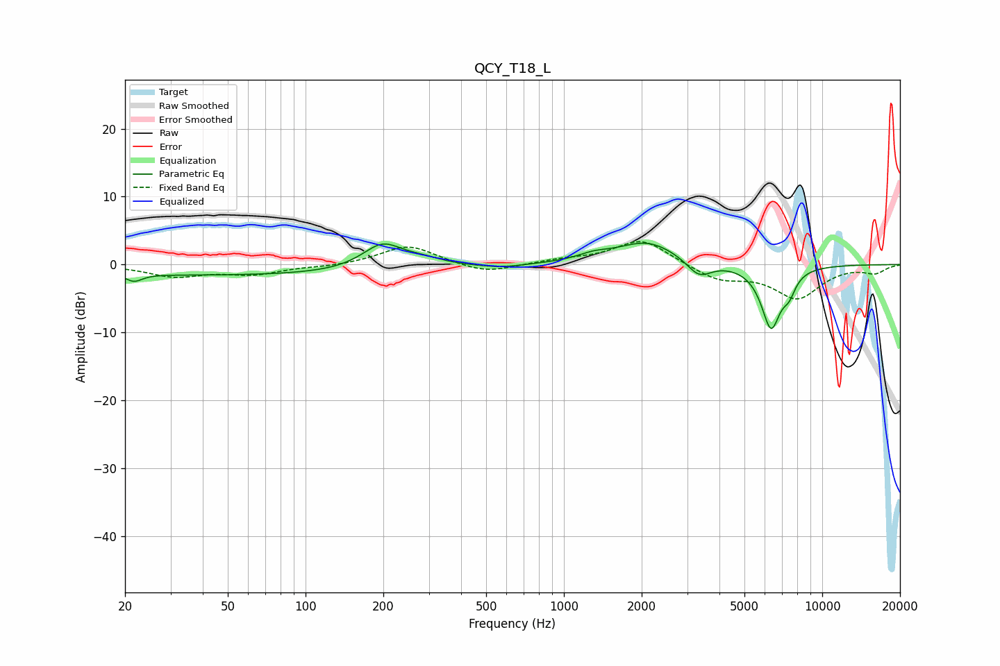

# QCY_T18_L
See [usage instructions](https://github.com/jaakkopasanen/AutoEq#usage) for more options and info.

### Parametric EQs
Apply preamp of -3.2 dB when using parametric equalizer.

|   # | Type    |   Fc (Hz) |    Q |   Gain (dB) |
|-----|---------|-----------|------|-------------|
|   1 | Peaking |        22 | 4.67 |        -1.1 |
|   2 | Peaking |        51 | 0.18 |        -1.6 |
|   3 | Peaking |       198 | 1.8  |         3.7 |
|   4 | Peaking |       284 | 1.76 |         0.9 |
|   5 | Peaking |       575 | 1.65 |        -0.5 |
|   6 | Peaking |      1299 | 2.35 |         0.8 |
|   7 | Peaking |      2104 | 1.18 |         3.4 |
|   8 | Peaking |      3334 | 2.93 |        -2.5 |
|   9 | Peaking |      6337 | 3.52 |        -9.1 |
|  10 | Peaking |      7443 | 5.37 |        -2.2 |

### Fixed Band EQs
When using fixed band (also called graphic) equalizer, apply preamp of **-3.5 dB** (if available) and set gains manually with these parameters.

|   # | Type    |   Fc (Hz) |    Q |   Gain (dB) |
|-----|---------|-----------|------|-------------|
|   1 | Peaking |        31 | 1.41 |        -1.7 |
|   2 | Peaking |        62 | 1.41 |        -1.3 |
|   3 | Peaking |       125 | 1.41 |        -0.3 |
|   4 | Peaking |       250 | 1.41 |         2.9 |
|   5 | Peaking |       500 | 1.41 |        -1.4 |
|   6 | Peaking |      1000 | 1.41 |         0.6 |
|   7 | Peaking |      2000 | 1.41 |         3.8 |
|   8 | Peaking |      4000 | 1.41 |        -2.2 |
|   9 | Peaking |      8000 | 1.41 |        -4.8 |
|  10 | Peaking |     16000 | 1.41 |        -1.1 |

### Graphs

