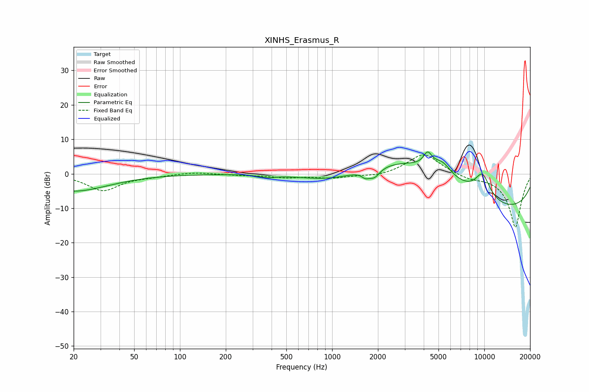

# XINHS_Erasmus_R
See [usage instructions](https://github.com/jaakkopasanen/AutoEq#usage) for more options and info.

### Parametric EQs
Apply preamp of -6.4 dB when using parametric equalizer.

|   # | Type    |   Fc (Hz) |    Q |   Gain (dB) |
|-----|---------|-----------|------|-------------|
|   1 | Peaking |        20 | 0.62 |        -5   |
|   2 | Peaking |       377 | 2.91 |        -0.7 |
|   3 | Peaking |      1038 | 0.56 |        -5.6 |
|   4 | Peaking |      1652 | 5.71 |        -1.5 |
|   5 | Peaking |      1893 | 3.89 |        -2.7 |
|   6 | Peaking |      3435 | 0.28 |        13.3 |
|   7 | Peaking |      4245 | 5.1  |         3.8 |
|   8 | Peaking |      5293 | 2.38 |         3.5 |
|   9 | Peaking |      9725 | 0.22 |       -14.7 |
|  10 | Peaking |      9729 | 2.42 |         7   |

### Fixed Band EQs
When using fixed band (also called graphic) equalizer, apply preamp of **-5.6 dB** (if available) and set gains manually with these parameters.

|   # | Type    |   Fc (Hz) |    Q |   Gain (dB) |
|-----|---------|-----------|------|-------------|
|   1 | Peaking |        31 | 1.41 |        -4.8 |
|   2 | Peaking |        62 | 1.41 |        -0.6 |
|   3 | Peaking |       125 | 1.41 |         0.5 |
|   4 | Peaking |       250 | 1.41 |        -0.4 |
|   5 | Peaking |       500 | 1.41 |        -1   |
|   6 | Peaking |      1000 | 1.41 |        -1.1 |
|   7 | Peaking |      2000 | 1.41 |        -0.8 |
|   8 | Peaking |      4000 | 1.41 |         6.1 |
|   9 | Peaking |      8000 | 1.41 |        -1.2 |
|  10 | Peaking |     16000 | 1.41 |       -15.6 |

### Graphs

