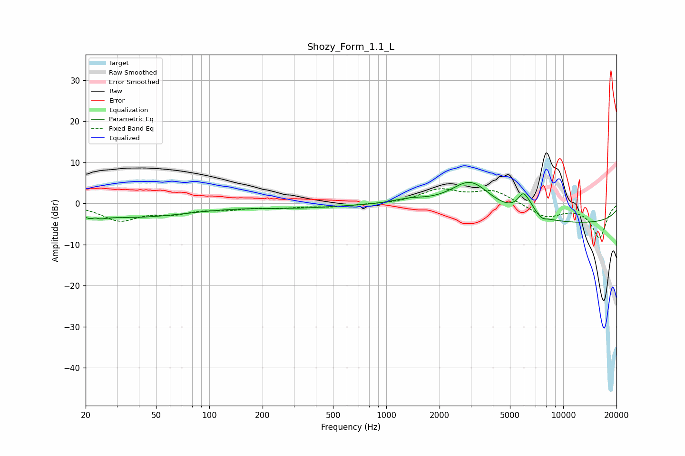

# Shozy_Form_1.1_L
See [usage instructions](https://github.com/jaakkopasanen/AutoEq#usage) for more options and info.

### Parametric EQs
Apply preamp of -5.2 dB when using parametric equalizer.

|   # | Type    |   Fc (Hz) |    Q |   Gain (dB) |
|-----|---------|-----------|------|-------------|
|   1 | Peaking |        22 | 4.14 |        -3.3 |
|   2 | Peaking |        23 | 5.89 |         2.5 |
|   3 | Peaking |        37 | 0.43 |        -3.2 |
|   4 | Peaking |       317 | 0.6  |        -0.9 |
|   5 | Peaking |      1349 | 1.49 |         1.2 |
|   6 | Peaking |      3002 | 1.15 |         8.2 |
|   7 | Peaking |      5956 | 4.12 |         4.6 |
|   8 | Peaking |      6560 | 5.4  |         0.9 |
|   9 | Peaking |      7616 | 6    |        -0.6 |
|  10 | Peaking |     10000 | 0.18 |        -4.9 |

### Fixed Band EQs
When using fixed band (also called graphic) equalizer, apply preamp of **-3.7 dB** (if available) and set gains manually with these parameters.

|   # | Type    |   Fc (Hz) |    Q |   Gain (dB) |
|-----|---------|-----------|------|-------------|
|   1 | Peaking |        31 | 1.41 |        -3.9 |
|   2 | Peaking |        62 | 1.41 |        -1.9 |
|   3 | Peaking |       125 | 1.41 |        -1.1 |
|   4 | Peaking |       250 | 1.41 |        -0.8 |
|   5 | Peaking |       500 | 1.41 |        -0.7 |
|   6 | Peaking |      1000 | 1.41 |        -0.2 |
|   7 | Peaking |      2000 | 1.41 |         3.2 |
|   8 | Peaking |      4000 | 1.41 |         3.1 |
|   9 | Peaking |      8000 | 1.41 |        -3.3 |
|  10 | Peaking |     16000 | 1.41 |        -8.3 |

### Graphs

