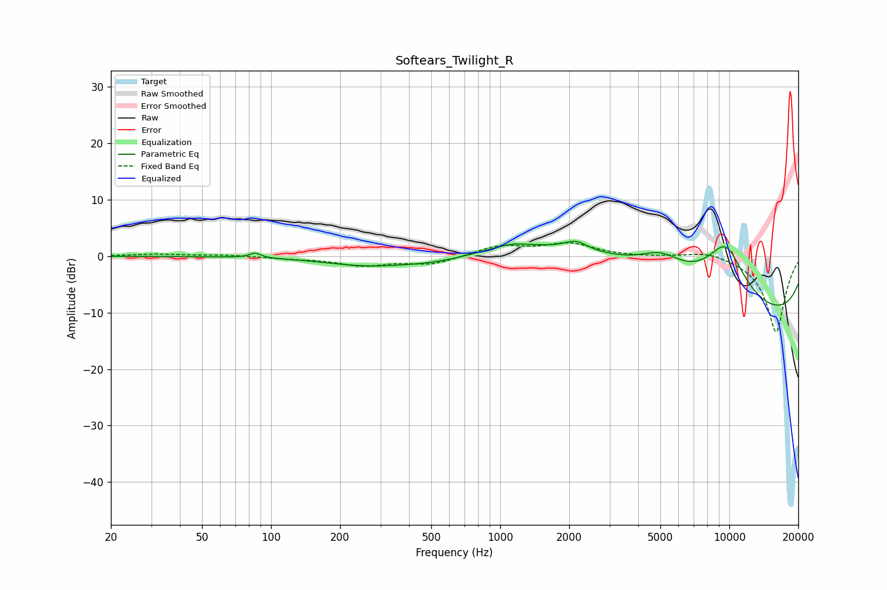

# Softears_Twilight_R
See [usage instructions](https://github.com/jaakkopasanen/AutoEq#usage) for more options and info.

### Parametric EQs
Apply preamp of -2.7 dB when using parametric equalizer.

|   # | Type    |   Fc (Hz) |    Q |   Gain (dB) |
|-----|---------|-----------|------|-------------|
|   1 | Peaking |        85 | 5.87 |         0.8 |
|   2 | Peaking |       263 | 0.73 |        -1.7 |
|   3 | Peaking |       557 | 0.7  |        -2.6 |
|   4 | Peaking |      1116 | 2.17 |         0.7 |
|   5 | Peaking |      2143 | 2.93 |         1.6 |
|   6 | Peaking |      2548 | 0.18 |         5.1 |
|   7 | Peaking |      5000 | 1.62 |         2.8 |
|   8 | Peaking |      5352 | 0.25 |         4.7 |
|   9 | Peaking |      9642 | 1.46 |         8.9 |
|  10 | Peaking |      9823 | 0.18 |       -14.8 |

### Fixed Band EQs
When using fixed band (also called graphic) equalizer, apply preamp of **-2.5 dB** (if available) and set gains manually with these parameters.

|   # | Type    |   Fc (Hz) |    Q |   Gain (dB) |
|-----|---------|-----------|------|-------------|
|   1 | Peaking |        31 | 1.41 |         0.4 |
|   2 | Peaking |        62 | 1.41 |         0.2 |
|   3 | Peaking |       125 | 1.41 |        -0.4 |
|   4 | Peaking |       250 | 1.41 |        -1.5 |
|   5 | Peaking |       500 | 1.41 |        -1.4 |
|   6 | Peaking |      1000 | 1.41 |         1.8 |
|   7 | Peaking |      2000 | 1.41 |         2.1 |
|   8 | Peaking |      4000 | 1.41 |        -0.1 |
|   9 | Peaking |      8000 | 1.41 |         1.1 |
|  10 | Peaking |     16000 | 1.41 |       -13.5 |

### Graphs

