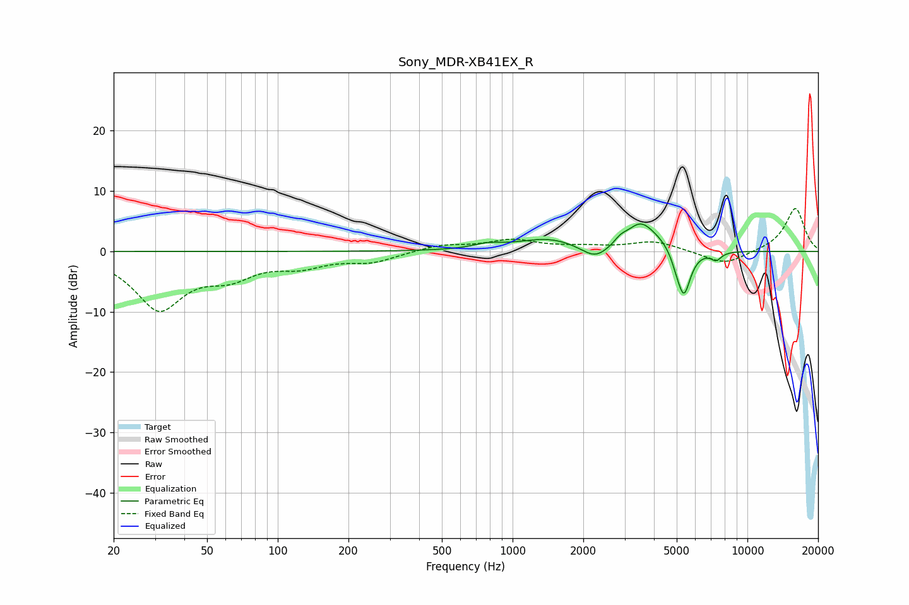

# Sony_MDR-XB41EX_R
See [usage instructions](https://github.com/jaakkopasanen/AutoEq#usage) for more options and info.

### Parametric EQs
Apply preamp of -4.6 dB when using parametric equalizer.

|   # | Type    |   Fc (Hz) |    Q |   Gain (dB) |
|-----|---------|-----------|------|-------------|
|   1 | Peaking |       778 | 2.42 |         0.7 |
|   2 | Peaking |      1428 | 1.03 |         2.1 |
|   3 | Peaking |      2093 | 2.09 |        -0.5 |
|   4 | Peaking |      2272 | 2.52 |        -1.9 |
|   5 | Peaking |      2879 | 5.48 |         0.9 |
|   6 | Peaking |      3492 | 2.39 |         4   |
|   7 | Peaking |      4264 | 1.77 |         1.4 |
|   8 | Peaking |      4981 | 6    |        -1.2 |
|   9 | Peaking |      5365 | 4.76 |        -7.8 |
|  10 | Peaking |      7360 | 6    |        -1.3 |

### Fixed Band EQs
When using fixed band (also called graphic) equalizer, apply preamp of **-7.2 dB** (if available) and set gains manually with these parameters.

|   # | Type    |   Fc (Hz) |    Q |   Gain (dB) |
|-----|---------|-----------|------|-------------|
|   1 | Peaking |        31 | 1.41 |        -9.3 |
|   2 | Peaking |        62 | 1.41 |        -3.3 |
|   3 | Peaking |       125 | 1.41 |        -2   |
|   4 | Peaking |       250 | 1.41 |        -1.6 |
|   5 | Peaking |       500 | 1.41 |         1.1 |
|   6 | Peaking |      1000 | 1.41 |         1.8 |
|   7 | Peaking |      2000 | 1.41 |         0.6 |
|   8 | Peaking |      4000 | 1.41 |         1.6 |
|   9 | Peaking |      8000 | 1.41 |        -2.3 |
|  10 | Peaking |     16000 | 1.41 |         7.2 |

### Graphs

