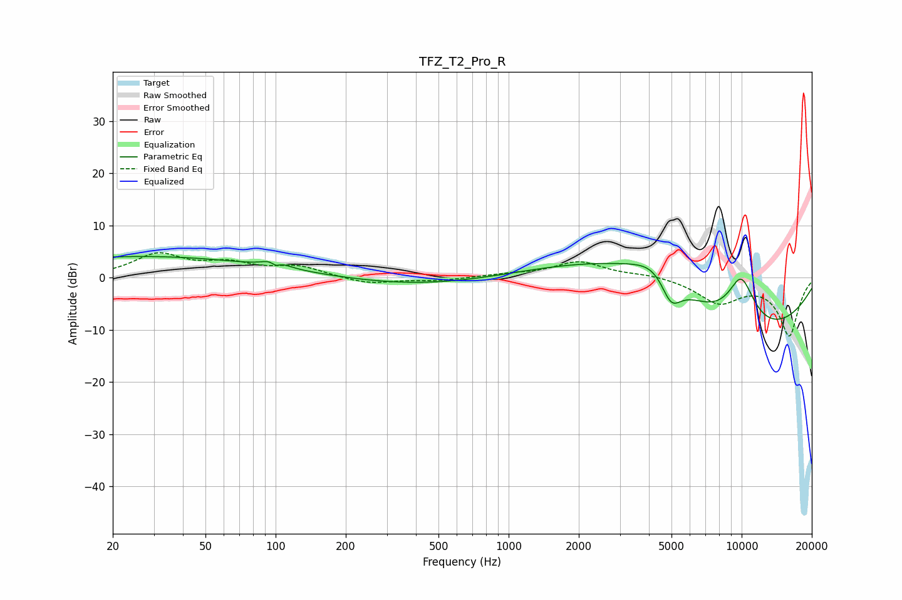

# TFZ_T2_Pro_R
See [usage instructions](https://github.com/jaakkopasanen/AutoEq#usage) for more options and info.

### Parametric EQs
Apply preamp of -4.2 dB when using parametric equalizer.

|   # | Type    |   Fc (Hz) |    Q |   Gain (dB) |
|-----|---------|-----------|------|-------------|
|   1 | Peaking |        39 | 0.19 |         4.5 |
|   2 | Peaking |        99 | 4.24 |         3.5 |
|   3 | Peaking |       100 | 5.92 |        -3.1 |
|   4 | Peaking |       254 | 0.27 |        -3   |
|   5 | Peaking |       297 | 0.24 |         0.5 |
|   6 | Peaking |      3134 | 0.41 |         7.5 |
|   7 | Peaking |      4540 | 1.28 |         6.6 |
|   8 | Peaking |      4966 | 2.76 |        -7.2 |
|   9 | Peaking |      9172 | 0.31 |       -14   |
|  10 | Peaking |      9945 | 1.84 |        10.6 |

### Fixed Band EQs
When using fixed band (also called graphic) equalizer, apply preamp of **-4.9 dB** (if available) and set gains manually with these parameters.

|   # | Type    |   Fc (Hz) |    Q |   Gain (dB) |
|-----|---------|-----------|------|-------------|
|   1 | Peaking |        31 | 1.41 |         4.3 |
|   2 | Peaking |        62 | 1.41 |         2.3 |
|   3 | Peaking |       125 | 1.41 |         2   |
|   4 | Peaking |       250 | 1.41 |        -1.3 |
|   5 | Peaking |       500 | 1.41 |        -0.6 |
|   6 | Peaking |      1000 | 1.41 |         0.5 |
|   7 | Peaking |      2000 | 1.41 |         3   |
|   8 | Peaking |      4000 | 1.41 |         0.6 |
|   9 | Peaking |      8000 | 1.41 |        -4.6 |
|  10 | Peaking |     16000 | 1.41 |       -11   |

### Graphs

