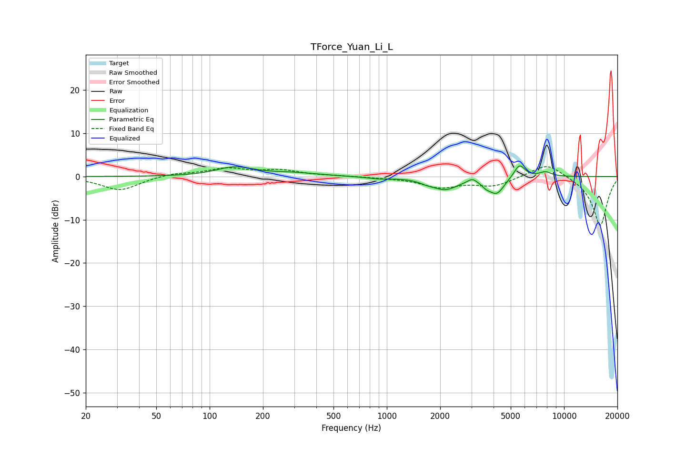

# TForce_Yuan_Li_L
See [usage instructions](https://github.com/jaakkopasanen/AutoEq#usage) for more options and info.

### Parametric EQs
Apply preamp of -2.6 dB when using parametric equalizer.

|   # | Type    |   Fc (Hz) |    Q |   Gain (dB) |
|-----|---------|-----------|------|-------------|
|   1 | Peaking |       138 | 1.38 |         2.1 |
|   2 | Peaking |       293 | 0.97 |         0.7 |
|   3 | Peaking |       904 | 1.98 |        -0.5 |
|   4 | Peaking |      1683 | 3.17 |        -0.6 |
|   5 | Peaking |      2137 | 1.95 |        -2.8 |
|   6 | Peaking |      3036 | 5.71 |         1   |
|   7 | Peaking |      3638 | 5.51 |        -1   |
|   8 | Peaking |      4172 | 3.28 |        -3.7 |
|   9 | Peaking |      5603 | 4.44 |         3.2 |
|  10 | Peaking |      7859 | 3.67 |         1.1 |

### Fixed Band EQs
When using fixed band (also called graphic) equalizer, apply preamp of **-2.4 dB** (if available) and set gains manually with these parameters.

|   # | Type    |   Fc (Hz) |    Q |   Gain (dB) |
|-----|---------|-----------|------|-------------|
|   1 | Peaking |        31 | 1.41 |        -3.2 |
|   2 | Peaking |        62 | 1.41 |         0.8 |
|   3 | Peaking |       125 | 1.41 |         1.8 |
|   4 | Peaking |       250 | 1.41 |         1.3 |
|   5 | Peaking |       500 | 1.41 |         0.1 |
|   6 | Peaking |      1000 | 1.41 |        -0.2 |
|   7 | Peaking |      2000 | 1.41 |        -2.4 |
|   8 | Peaking |      4000 | 1.41 |        -2.1 |
|   9 | Peaking |      8000 | 1.41 |         3.3 |
|  10 | Peaking |     16000 | 1.41 |       -11.5 |

### Graphs

