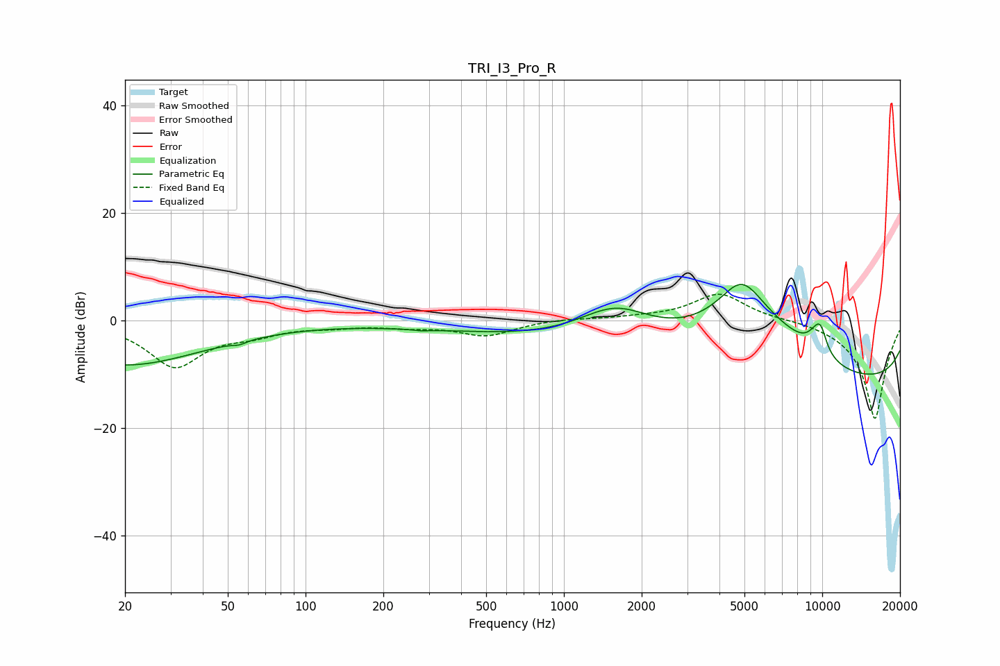

# TRI_I3_Pro_R
See [usage instructions](https://github.com/jaakkopasanen/AutoEq#usage) for more options and info.

### Parametric EQs
Apply preamp of -6.8 dB when using parametric equalizer.

|   # | Type    |   Fc (Hz) |    Q |   Gain (dB) |
|-----|---------|-----------|------|-------------|
|   1 | Peaking |        20 | 0.45 |        -8.2 |
|   2 | Peaking |        55 | 5.58 |        -0.5 |
|   3 | Peaking |       279 | 5.32 |        -0.2 |
|   4 | Peaking |       519 | 0.37 |        -1.4 |
|   5 | Peaking |      1582 | 0.94 |         6.8 |
|   6 | Peaking |      4878 | 1.3  |        11.2 |
|   7 | Peaking |      6849 | 0.39 |        13.3 |
|   8 | Peaking |      8971 | 0.19 |       -20   |
|   9 | Peaking |      9506 | 3.54 |         3.5 |
|  10 | Peaking |      9896 | 5.87 |         2.7 |

### Fixed Band EQs
When using fixed band (also called graphic) equalizer, apply preamp of **-5.0 dB** (if available) and set gains manually with these parameters.

|   # | Type    |   Fc (Hz) |    Q |   Gain (dB) |
|-----|---------|-----------|------|-------------|
|   1 | Peaking |        31 | 1.41 |        -8.4 |
|   2 | Peaking |        62 | 1.41 |        -1.9 |
|   3 | Peaking |       125 | 1.41 |        -0.8 |
|   4 | Peaking |       250 | 1.41 |        -0.9 |
|   5 | Peaking |       500 | 1.41 |        -2.7 |
|   6 | Peaking |      1000 | 1.41 |         0.4 |
|   7 | Peaking |      2000 | 1.41 |         0.4 |
|   8 | Peaking |      4000 | 1.41 |         5.1 |
|   9 | Peaking |      8000 | 1.41 |         0.3 |
|  10 | Peaking |     16000 | 1.41 |       -18.4 |

### Graphs

