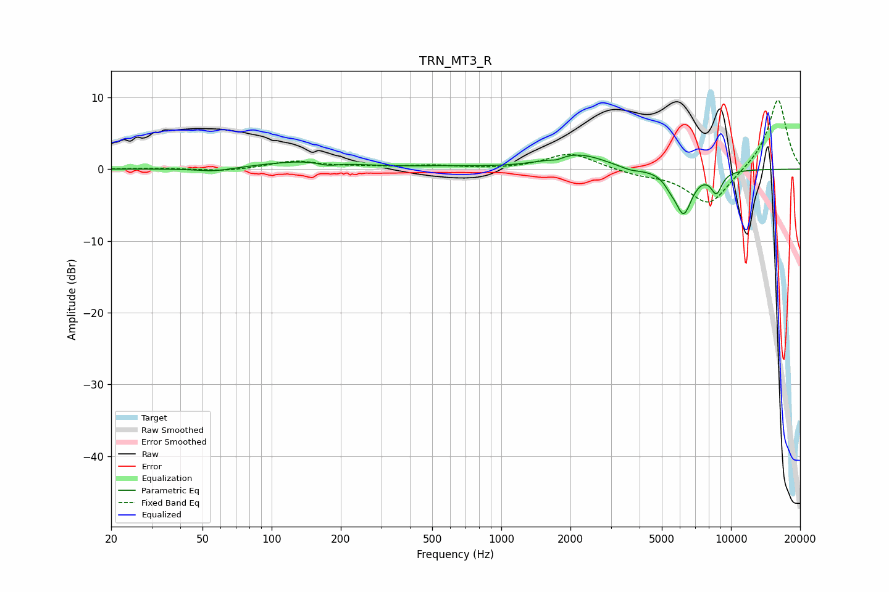

# TRN_MT3_R
See [usage instructions](https://github.com/jaakkopasanen/AutoEq#usage) for more options and info.

### Parametric EQs
Apply preamp of -2.1 dB when using parametric equalizer.

|   # | Type    |   Fc (Hz) |    Q |   Gain (dB) |
|-----|---------|-----------|------|-------------|
|   1 | Peaking |        56 | 1.75 |        -0.5 |
|   2 | Peaking |       141 | 0.75 |         1.1 |
|   3 | Peaking |       176 | 3.29 |        -0.5 |
|   4 | Peaking |       564 | 0.83 |         0.3 |
|   5 | Peaking |      1746 | 5.38 |        -0.4 |
|   6 | Peaking |      2143 | 1.15 |         2.1 |
|   7 | Peaking |      3636 | 2.79 |        -0.5 |
|   8 | Peaking |      5430 | 5.55 |        -0.8 |
|   9 | Peaking |      6217 | 3.63 |        -6   |
|  10 | Peaking |      8643 | 5.27 |        -2.9 |

### Fixed Band EQs
When using fixed band (also called graphic) equalizer, apply preamp of **-9.7 dB** (if available) and set gains manually with these parameters.

|   # | Type    |   Fc (Hz) |    Q |   Gain (dB) |
|-----|---------|-----------|------|-------------|
|   1 | Peaking |        31 | 1.41 |         0.1 |
|   2 | Peaking |        62 | 1.41 |        -0.3 |
|   3 | Peaking |       125 | 1.41 |         1.1 |
|   4 | Peaking |       250 | 1.41 |         0.3 |
|   5 | Peaking |       500 | 1.41 |         0.5 |
|   6 | Peaking |      1000 | 1.41 |        -0.1 |
|   7 | Peaking |      2000 | 1.41 |         2.3 |
|   8 | Peaking |      4000 | 1.41 |        -0.7 |
|   9 | Peaking |      8000 | 1.41 |        -5.1 |
|  10 | Peaking |     16000 | 1.41 |         9.9 |

### Graphs

