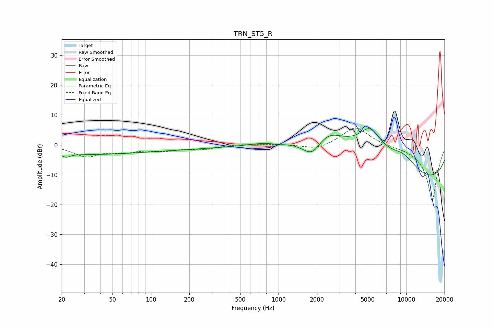

# TRN_ST5_R
See [usage instructions](https://github.com/jaakkopasanen/AutoEq#usage) for more options and info.

### Parametric EQs
Apply preamp of -5.5 dB when using parametric equalizer.

|   # | Type    |   Fc (Hz) |    Q |   Gain (dB) |
|-----|---------|-----------|------|-------------|
|   1 | Peaking |        20 | 0.31 |        -2.6 |
|   2 | Peaking |        22 | 5.19 |        -1.1 |
|   3 | Peaking |       112 | 0.3  |        -1.5 |
|   4 | Peaking |       735 | 1.58 |         0.6 |
|   5 | Peaking |      1009 | 4.58 |        -0.3 |
|   6 | Peaking |      1853 | 1.6  |        -8.5 |
|   7 | Peaking |      2302 | 0.76 |        12.9 |
|   8 | Peaking |      5223 | 1.3  |        11.4 |
|   9 | Peaking |      9389 | 0.94 |         7.5 |
|  10 | Peaking |     10000 | 0.18 |       -14.2 |

### Fixed Band EQs
When using fixed band (also called graphic) equalizer, apply preamp of **-5.7 dB** (if available) and set gains manually with these parameters.

|   # | Type    |   Fc (Hz) |    Q |   Gain (dB) |
|-----|---------|-----------|------|-------------|
|   1 | Peaking |        31 | 1.41 |        -3.6 |
|   2 | Peaking |        62 | 1.41 |        -1.9 |
|   3 | Peaking |       125 | 1.41 |        -1.6 |
|   4 | Peaking |       250 | 1.41 |        -1.3 |
|   5 | Peaking |       500 | 1.41 |         0.3 |
|   6 | Peaking |      1000 | 1.41 |         0.2 |
|   7 | Peaking |      2000 | 1.41 |        -1.8 |
|   8 | Peaking |      4000 | 1.41 |         6.3 |
|   9 | Peaking |      8000 | 1.41 |        -0.2 |
|  10 | Peaking |     16000 | 1.41 |       -18.9 |

### Graphs

