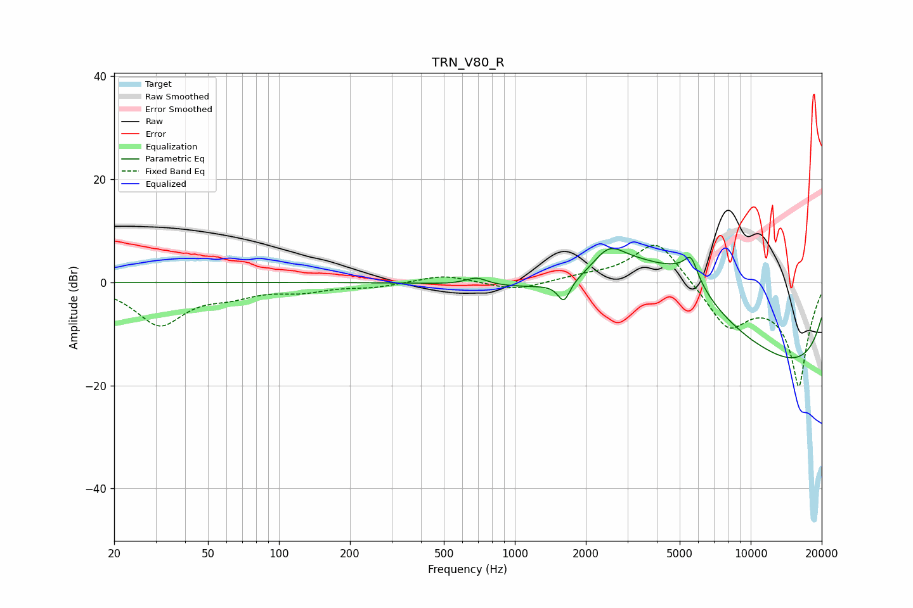

# TRN_V80_R
See [usage instructions](https://github.com/jaakkopasanen/AutoEq#usage) for more options and info.

### Parametric EQs
Apply preamp of -6.6 dB when using parametric equalizer.

|   # | Type    |   Fc (Hz) |    Q |   Gain (dB) |
|-----|---------|-----------|------|-------------|
|   1 | Peaking |       687 | 3.13 |         1.4 |
|   2 | Peaking |      1615 | 5.53 |        -3.9 |
|   3 | Peaking |      2498 | 1.92 |         5.6 |
|   4 | Peaking |      3469 | 0.65 |        10.4 |
|   5 | Peaking |      5372 | 1.47 |         5.1 |
|   6 | Peaking |      5586 | 5.31 |         3.6 |
|   7 | Peaking |      6681 | 0.37 |         8.3 |
|   8 | Peaking |      9269 | 0.18 |        -7.9 |
|   9 | Peaking |     10000 | 0.18 |       -13.2 |
|  10 | Peaking |     10000 | 5.98 |        -0.1 |

### Fixed Band EQs
When using fixed band (also called graphic) equalizer, apply preamp of **-7.3 dB** (if available) and set gains manually with these parameters.

|   # | Type    |   Fc (Hz) |    Q |   Gain (dB) |
|-----|---------|-----------|------|-------------|
|   1 | Peaking |        31 | 1.41 |        -8.1 |
|   2 | Peaking |        62 | 1.41 |        -1.9 |
|   3 | Peaking |       125 | 1.41 |        -1.5 |
|   4 | Peaking |       250 | 1.41 |        -0.8 |
|   5 | Peaking |       500 | 1.41 |         1.5 |
|   6 | Peaking |      1000 | 1.41 |        -1.6 |
|   7 | Peaking |      2000 | 1.41 |         0.9 |
|   8 | Peaking |      4000 | 1.41 |         8.7 |
|   9 | Peaking |      8000 | 1.41 |        -8.3 |
|  10 | Peaking |     16000 | 1.41 |       -20   |

### Graphs

