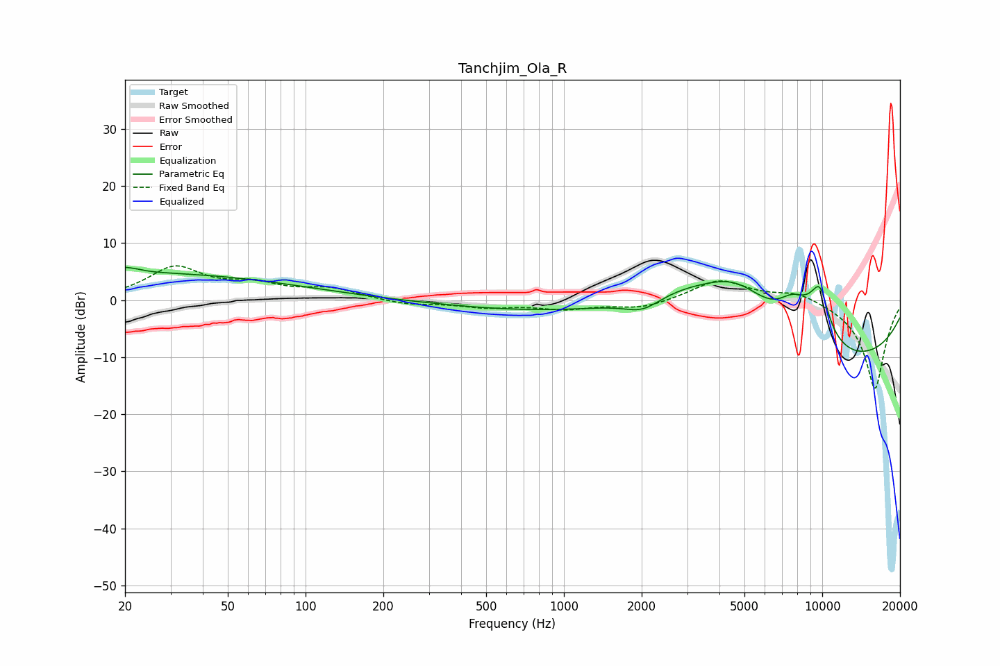

# Tanchjim_Ola_R
See [usage instructions](https://github.com/jaakkopasanen/AutoEq#usage) for more options and info.

### Parametric EQs
Apply preamp of -5.9 dB when using parametric equalizer.

|   # | Type    |   Fc (Hz) |    Q |   Gain (dB) |
|-----|---------|-----------|------|-------------|
|   1 | Peaking |        20 | 4.13 |         3.4 |
|   2 | Peaking |        20 | 4.99 |        -2.3 |
|   3 | Peaking |        23 | 0.23 |         4.7 |
|   4 | Peaking |      2019 | 1.97 |        -2.4 |
|   5 | Peaking |      2939 | 0.36 |        15   |
|   6 | Peaking |      4699 | 0.87 |         9.1 |
|   7 | Peaking |      5547 | 0.18 |       -20   |
|   8 | Peaking |      7677 | 2.14 |         4.6 |
|   9 | Peaking |      9468 | 1.95 |         5.8 |
|  10 | Peaking |      9834 | 4.29 |         4.5 |

### Fixed Band EQs
When using fixed band (also called graphic) equalizer, apply preamp of **-6.1 dB** (if available) and set gains manually with these parameters.

|   # | Type    |   Fc (Hz) |    Q |   Gain (dB) |
|-----|---------|-----------|------|-------------|
|   1 | Peaking |        31 | 1.41 |         5.5 |
|   2 | Peaking |        62 | 1.41 |         2.3 |
|   3 | Peaking |       125 | 1.41 |         1.8 |
|   4 | Peaking |       250 | 1.41 |        -0.8 |
|   5 | Peaking |       500 | 1.41 |        -1.1 |
|   6 | Peaking |      1000 | 1.41 |        -1.4 |
|   7 | Peaking |      2000 | 1.41 |        -1.4 |
|   8 | Peaking |      4000 | 1.41 |         3.6 |
|   9 | Peaking |      8000 | 1.41 |         1.7 |
|  10 | Peaking |     16000 | 1.41 |       -15.7 |

### Graphs

