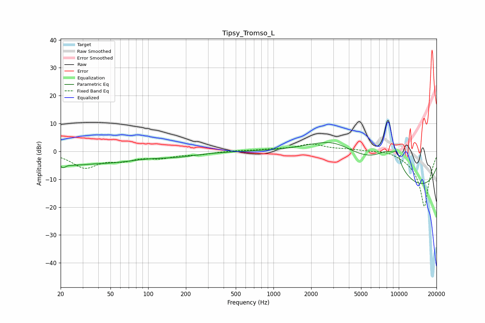

# Tipsy_Tromso_L
See [usage instructions](https://github.com/jaakkopasanen/AutoEq#usage) for more options and info.

### Parametric EQs
Apply preamp of -3.3 dB when using parametric equalizer.

|   # | Type    |   Fc (Hz) |    Q |   Gain (dB) |
|-----|---------|-----------|------|-------------|
|   1 | Peaking |        20 | 0.19 |        -2.2 |
|   2 | Peaking |        21 | 5.39 |        -2.2 |
|   3 | Peaking |        24 | 5.98 |        -0.3 |
|   4 | Peaking |        28 | 1.67 |        -1.2 |
|   5 | Peaking |        48 | 0.65 |        -1.9 |
|   6 | Peaking |       172 | 0.9  |        -1.2 |
|   7 | Peaking |      3018 | 0.52 |        12   |
|   8 | Peaking |      8340 | 1.02 |        11.1 |
|   9 | Peaking |      9672 | 5.15 |         3.8 |
|  10 | Peaking |     10000 | 0.18 |       -16.2 |

### Fixed Band EQs
When using fixed band (also called graphic) equalizer, apply preamp of **-2.7 dB** (if available) and set gains manually with these parameters.

|   # | Type    |   Fc (Hz) |    Q |   Gain (dB) |
|-----|---------|-----------|------|-------------|
|   1 | Peaking |        31 | 1.41 |        -5.6 |
|   2 | Peaking |        62 | 1.41 |        -2.5 |
|   3 | Peaking |       125 | 1.41 |        -2   |
|   4 | Peaking |       250 | 1.41 |        -0.9 |
|   5 | Peaking |       500 | 1.41 |         0.3 |
|   6 | Peaking |      1000 | 1.41 |         0.6 |
|   7 | Peaking |      2000 | 1.41 |         2.4 |
|   8 | Peaking |      4000 | 1.41 |         0.7 |
|   9 | Peaking |      8000 | 1.41 |         1   |
|  10 | Peaking |     16000 | 1.41 |       -20   |

### Graphs

