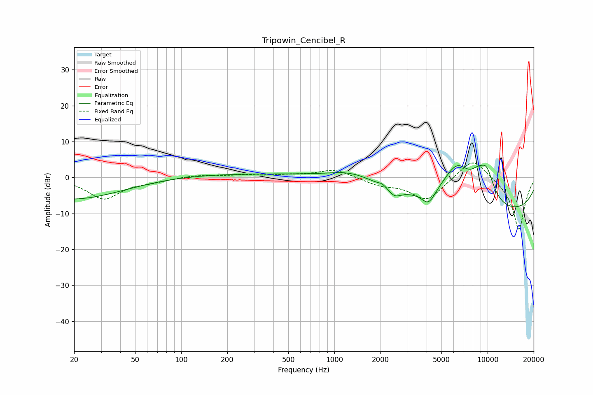

# Tripowin_Cencibel_R
See [usage instructions](https://github.com/jaakkopasanen/AutoEq#usage) for more options and info.

### Parametric EQs
Apply preamp of -3.5 dB when using parametric equalizer.

|   # | Type    |   Fc (Hz) |    Q |   Gain (dB) |
|-----|---------|-----------|------|-------------|
|   1 | Peaking |        20 | 0.41 |        -6.4 |
|   2 | Peaking |       161 | 0.18 |         1.2 |
|   3 | Peaking |      1318 | 0.87 |         3.2 |
|   4 | Peaking |      2053 | 5.9  |         0.8 |
|   5 | Peaking |      2476 | 3.6  |        -2.1 |
|   6 | Peaking |      4120 | 3.16 |        -4.1 |
|   7 | Peaking |      6309 | 1.23 |        11.9 |
|   8 | Peaking |      8635 | 2.75 |         3.3 |
|   9 | Peaking |      9862 | 2.47 |         7.8 |
|  10 | Peaking |     10000 | 0.19 |       -10.6 |

### Fixed Band EQs
When using fixed band (also called graphic) equalizer, apply preamp of **-4.1 dB** (if available) and set gains manually with these parameters.

|   # | Type    |   Fc (Hz) |    Q |   Gain (dB) |
|-----|---------|-----------|------|-------------|
|   1 | Peaking |        31 | 1.41 |        -5.9 |
|   2 | Peaking |        62 | 1.41 |        -0.9 |
|   3 | Peaking |       125 | 1.41 |         0.7 |
|   4 | Peaking |       250 | 1.41 |         0.6 |
|   5 | Peaking |       500 | 1.41 |         0.5 |
|   6 | Peaking |      1000 | 1.41 |         2.3 |
|   7 | Peaking |      2000 | 1.41 |        -1.9 |
|   8 | Peaking |      4000 | 1.41 |        -6.3 |
|   9 | Peaking |      8000 | 1.41 |         6   |
|  10 | Peaking |     16000 | 1.41 |       -14.8 |

### Graphs

