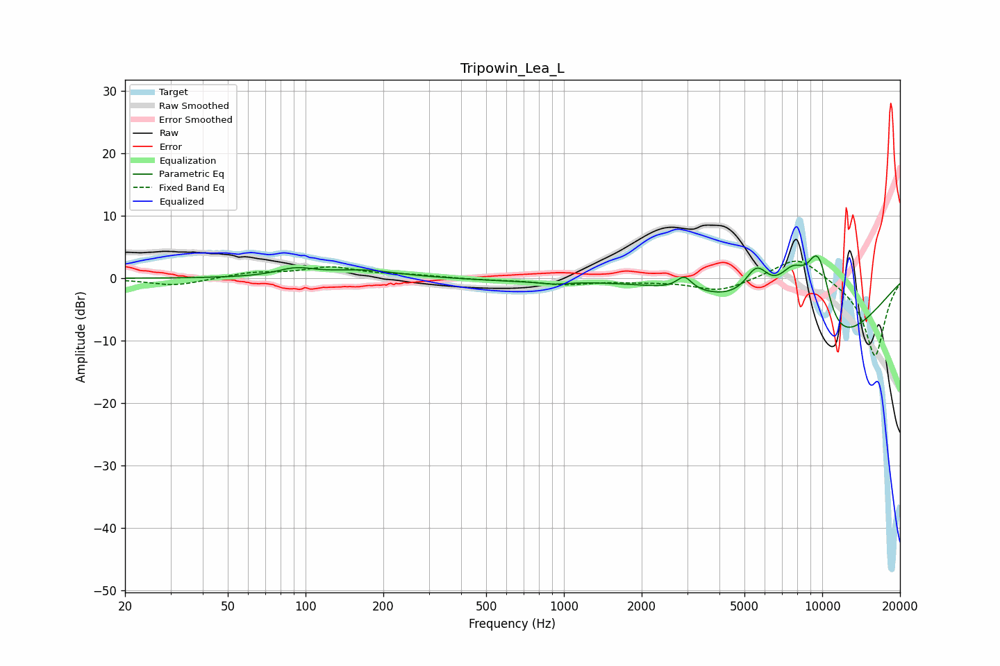

# Tripowin_Lea_L
See [usage instructions](https://github.com/jaakkopasanen/AutoEq#usage) for more options and info.

### Parametric EQs
Apply preamp of -3.7 dB when using parametric equalizer.

|   # | Type    |   Fc (Hz) |    Q |   Gain (dB) |
|-----|---------|-----------|------|-------------|
|   1 | Peaking |        92 | 1.95 |         1.3 |
|   2 | Peaking |       167 | 1.05 |         1.2 |
|   3 | Peaking |       682 | 0.75 |        -0.4 |
|   4 | Peaking |       914 | 2.83 |        -0.4 |
|   5 | Peaking |      2923 | 4.79 |         2.2 |
|   6 | Peaking |      5581 | 2.92 |         5.2 |
|   7 | Peaking |      7736 | 1.81 |         8.9 |
|   8 | Peaking |      9437 | 2.69 |         6.5 |
|   9 | Peaking |      9880 | 2.84 |         6.5 |
|  10 | Peaking |     10000 | 0.57 |       -13.8 |

### Fixed Band EQs
When using fixed band (also called graphic) equalizer, apply preamp of **-2.8 dB** (if available) and set gains manually with these parameters.

|   # | Type    |   Fc (Hz) |    Q |   Gain (dB) |
|-----|---------|-----------|------|-------------|
|   1 | Peaking |        31 | 1.41 |        -1.2 |
|   2 | Peaking |        62 | 1.41 |         0.8 |
|   3 | Peaking |       125 | 1.41 |         1.7 |
|   4 | Peaking |       250 | 1.41 |         0.4 |
|   5 | Peaking |       500 | 1.41 |        -0.2 |
|   6 | Peaking |      1000 | 1.41 |        -0.9 |
|   7 | Peaking |      2000 | 1.41 |        -0.3 |
|   8 | Peaking |      4000 | 1.41 |        -2   |
|   9 | Peaking |      8000 | 1.41 |         3.9 |
|  10 | Peaking |     16000 | 1.41 |       -12.6 |

### Graphs

