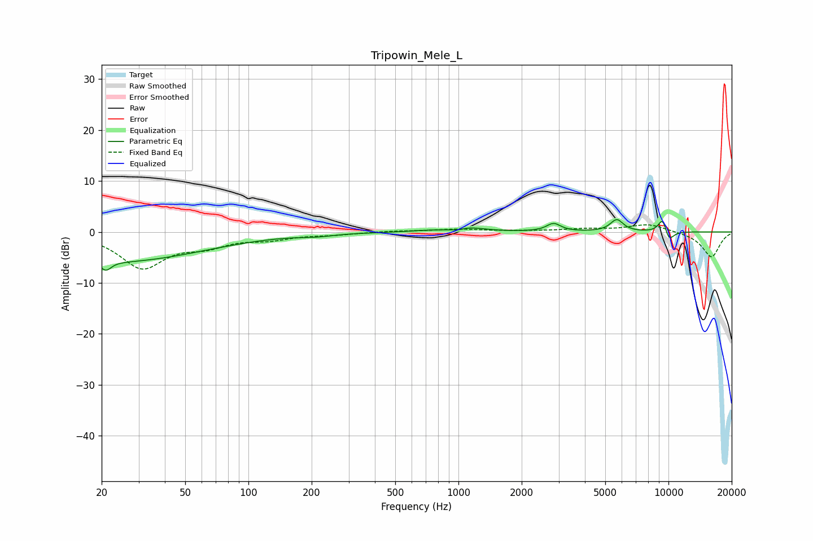

# Tripowin_Mele_L
See [usage instructions](https://github.com/jaakkopasanen/AutoEq#usage) for more options and info.

### Parametric EQs
Apply preamp of -2.5 dB when using parametric equalizer.

|   # | Type    |   Fc (Hz) |    Q |   Gain (dB) |
|-----|---------|-----------|------|-------------|
|   1 | Peaking |        21 | 5.67 |        -1.8 |
|   2 | Peaking |        24 | 0.34 |        -5.8 |
|   3 | Peaking |       211 | 1.79 |        -0.4 |
|   4 | Peaking |       686 | 2.05 |         0.2 |
|   5 | Peaking |       991 | 4.91 |        -0.4 |
|   6 | Peaking |      1099 | 1.81 |         0.9 |
|   7 | Peaking |      2840 | 4.28 |         1.6 |
|   8 | Peaking |      5675 | 4.51 |         2.4 |
|   9 | Peaking |      9403 | 5.78 |         3.4 |
|  10 | Peaking |     10000 | 5.06 |        -2.6 |

### Fixed Band EQs
When using fixed band (also called graphic) equalizer, apply preamp of **-1.5 dB** (if available) and set gains manually with these parameters.

|   # | Type    |   Fc (Hz) |    Q |   Gain (dB) |
|-----|---------|-----------|------|-------------|
|   1 | Peaking |        31 | 1.41 |        -6.8 |
|   2 | Peaking |        62 | 1.41 |        -2.2 |
|   3 | Peaking |       125 | 1.41 |        -1.2 |
|   4 | Peaking |       250 | 1.41 |        -0.4 |
|   5 | Peaking |       500 | 1.41 |         0.2 |
|   6 | Peaking |      1000 | 1.41 |         0.5 |
|   7 | Peaking |      2000 | 1.41 |         0.1 |
|   8 | Peaking |      4000 | 1.41 |         0.5 |
|   9 | Peaking |      8000 | 1.41 |         1.5 |
|  10 | Peaking |     16000 | 1.41 |        -5   |

### Graphs

