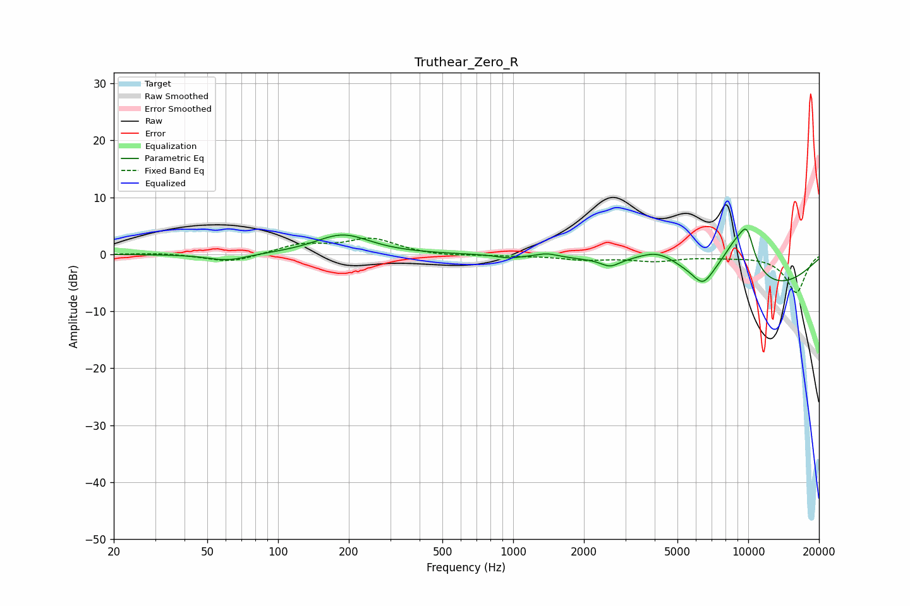

# Truthear_Zero_R
See [usage instructions](https://github.com/jaakkopasanen/AutoEq#usage) for more options and info.

### Parametric EQs
Apply preamp of -4.5 dB when using parametric equalizer.

|   # | Type    |   Fc (Hz) |    Q |   Gain (dB) |
|-----|---------|-----------|------|-------------|
|   1 | Peaking |        61 | 1.64 |        -1.2 |
|   2 | Peaking |       188 | 1.22 |         3.5 |
|   3 | Peaking |       961 | 2.85 |        -0.5 |
|   4 | Peaking |      1395 | 3.25 |         0.6 |
|   5 | Peaking |      2585 | 3.63 |        -1.3 |
|   6 | Peaking |      4142 | 1.43 |         3.4 |
|   7 | Peaking |      6412 | 3.24 |        -2.9 |
|   8 | Peaking |      8995 | 1.56 |         8.4 |
|   9 | Peaking |      9883 | 4.16 |         4.6 |
|  10 | Peaking |     10000 | 0.37 |        -7.5 |

### Fixed Band EQs
When using fixed band (also called graphic) equalizer, apply preamp of **-2.9 dB** (if available) and set gains manually with these parameters.

|   # | Type    |   Fc (Hz) |    Q |   Gain (dB) |
|-----|---------|-----------|------|-------------|
|   1 | Peaking |        31 | 1.41 |         0.3 |
|   2 | Peaking |        62 | 1.41 |        -1.5 |
|   3 | Peaking |       125 | 1.41 |         1.7 |
|   4 | Peaking |       250 | 1.41 |         2.6 |
|   5 | Peaking |       500 | 1.41 |        -0.4 |
|   6 | Peaking |      1000 | 1.41 |        -0.2 |
|   7 | Peaking |      2000 | 1.41 |        -0.8 |
|   8 | Peaking |      4000 | 1.41 |        -1   |
|   9 | Peaking |      8000 | 1.41 |        -0.3 |
|  10 | Peaking |     16000 | 1.41 |        -6.7 |

### Graphs

