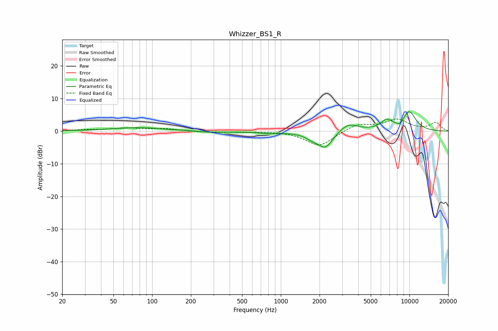

# Whizzer_BS1_R
See [usage instructions](https://github.com/jaakkopasanen/AutoEq#usage) for more options and info.

### Parametric EQs
Apply preamp of -6.0 dB when using parametric equalizer.

|   # | Type    |   Fc (Hz) |    Q |   Gain (dB) |
|-----|---------|-----------|------|-------------|
|   1 | Peaking |        83 | 0.62 |         1.1 |
|   2 | Peaking |       131 | 2.29 |        -0.2 |
|   3 | Peaking |       295 | 1.3  |        -0.5 |
|   4 | Peaking |       829 | 1.53 |        -0.6 |
|   5 | Peaking |      1750 | 2.51 |        -1.3 |
|   6 | Peaking |      2226 | 2.35 |        -5.1 |
|   7 | Peaking |      3330 | 1.91 |         2.6 |
|   8 | Peaking |      6668 | 2.86 |         2.8 |
|   9 | Peaking |      8448 | 5    |        -1.2 |
|  10 | Peaking |      9955 | 2.28 |         5.9 |

### Fixed Band EQs
When using fixed band (also called graphic) equalizer, apply preamp of **-3.8 dB** (if available) and set gains manually with these parameters.

|   # | Type    |   Fc (Hz) |    Q |   Gain (dB) |
|-----|---------|-----------|------|-------------|
|   1 | Peaking |        31 | 1.41 |         0.4 |
|   2 | Peaking |        62 | 1.41 |         0.8 |
|   3 | Peaking |       125 | 1.41 |         0.7 |
|   4 | Peaking |       250 | 1.41 |        -0.3 |
|   5 | Peaking |       500 | 1.41 |        -0.2 |
|   6 | Peaking |      1000 | 1.41 |         0.1 |
|   7 | Peaking |      2000 | 1.41 |        -4.7 |
|   8 | Peaking |      4000 | 1.41 |         2.2 |
|   9 | Peaking |      8000 | 1.41 |         3.4 |
|  10 | Peaking |     16000 | 1.41 |         2.5 |

### Graphs

