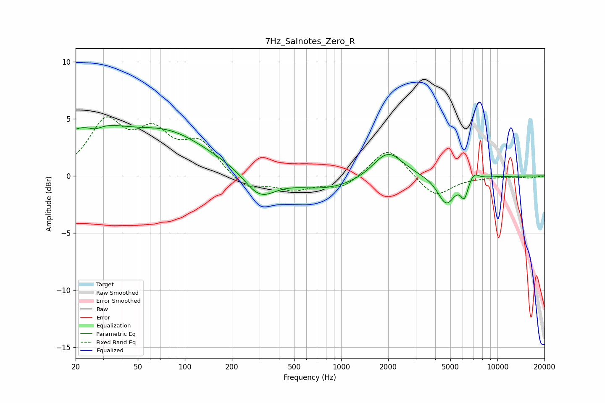

# 7Hz_Salnotes_Zero_R
See [usage instructions](https://github.com/jaakkopasanen/AutoEq#usage) for more options and info.

### Parametric EQs
Apply preamp of -4.5 dB when using parametric equalizer.

|   # | Type    |   Fc (Hz) |    Q |   Gain (dB) |
|-----|---------|-----------|------|-------------|
|   1 | Peaking |        24 | 0.63 |         3.8 |
|   2 | Peaking |        27 | 2.89 |        -0.6 |
|   3 | Peaking |        80 | 0.56 |         3.2 |
|   4 | Peaking |       280 | 0.79 |         0.8 |
|   5 | Peaking |       299 | 1.32 |        -2.7 |
|   6 | Peaking |       802 | 0.6  |        -1.2 |
|   7 | Peaking |      1992 | 1.46 |         2.4 |
|   8 | Peaking |      4707 | 2.54 |        -2.4 |
|   9 | Peaking |      6143 | 6    |        -1.5 |
|  10 | Peaking |      7077 | 4.67 |         0.6 |

### Fixed Band EQs
When using fixed band (also called graphic) equalizer, apply preamp of **-5.3 dB** (if available) and set gains manually with these parameters.

|   # | Type    |   Fc (Hz) |    Q |   Gain (dB) |
|-----|---------|-----------|------|-------------|
|   1 | Peaking |        31 | 1.41 |         4.5 |
|   2 | Peaking |        62 | 1.41 |         3.3 |
|   3 | Peaking |       125 | 1.41 |         2.7 |
|   4 | Peaking |       250 | 1.41 |        -1.3 |
|   5 | Peaking |       500 | 1.41 |        -1.1 |
|   6 | Peaking |      1000 | 1.41 |        -1.1 |
|   7 | Peaking |      2000 | 1.41 |         2.6 |
|   8 | Peaking |      4000 | 1.41 |        -1.9 |
|   9 | Peaking |      8000 | 1.41 |        -0.1 |
|  10 | Peaking |     16000 | 1.41 |        -0.2 |

### Graphs

