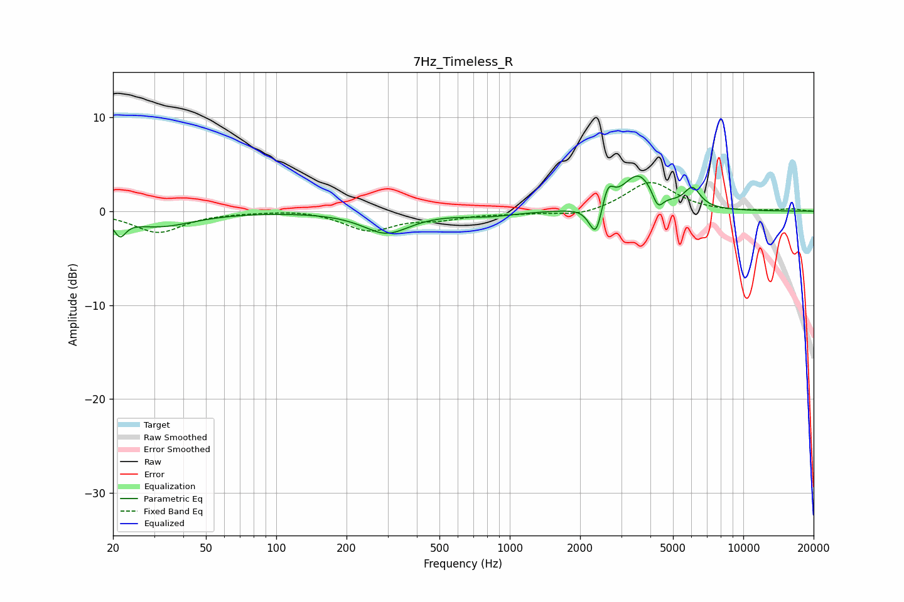

# 7Hz_Timeless_R
See [usage instructions](https://github.com/jaakkopasanen/AutoEq#usage) for more options and info.

### Parametric EQs
Apply preamp of -3.8 dB when using parametric equalizer.

|   # | Type    |   Fc (Hz) |    Q |   Gain (dB) |
|-----|---------|-----------|------|-------------|
|   1 | Peaking |        21 | 5.88 |        -1.7 |
|   2 | Peaking |        32 | 0.96 |        -1.6 |
|   3 | Peaking |       296 | 1.43 |        -2.3 |
|   4 | Peaking |       807 | 1.22 |        -0.5 |
|   5 | Peaking |      2244 | 5.04 |        -0.8 |
|   6 | Peaking |      2351 | 6    |        -2.7 |
|   7 | Peaking |      2633 | 5.99 |         2.2 |
|   8 | Peaking |      3565 | 2.05 |         3.9 |
|   9 | Peaking |      4306 | 6    |        -1.8 |
|  10 | Peaking |      6052 | 4.03 |         2.1 |

### Fixed Band EQs
When using fixed band (also called graphic) equalizer, apply preamp of **-3.1 dB** (if available) and set gains manually with these parameters.

|   # | Type    |   Fc (Hz) |    Q |   Gain (dB) |
|-----|---------|-----------|------|-------------|
|   1 | Peaking |        31 | 1.41 |        -2.2 |
|   2 | Peaking |        62 | 1.41 |        -0   |
|   3 | Peaking |       125 | 1.41 |         0.2 |
|   4 | Peaking |       250 | 1.41 |        -2   |
|   5 | Peaking |       500 | 1.41 |        -0.7 |
|   6 | Peaking |      1000 | 1.41 |        -0.2 |
|   7 | Peaking |      2000 | 1.41 |        -0.6 |
|   8 | Peaking |      4000 | 1.41 |         3.2 |
|   9 | Peaking |      8000 | 1.41 |        -0.1 |
|  10 | Peaking |     16000 | 1.41 |         0.2 |

### Graphs

