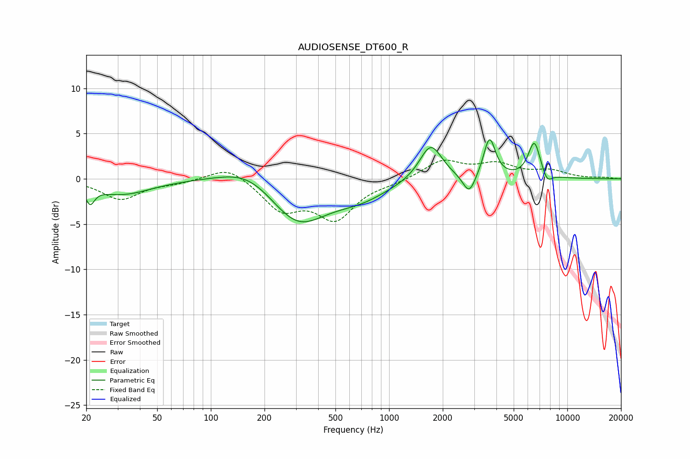

# AUDIOSENSE_DT600_R
See [usage instructions](https://github.com/jaakkopasanen/AutoEq#usage) for more options and info.

### Parametric EQs
Apply preamp of -4.4 dB when using parametric equalizer.

|   # | Type    |   Fc (Hz) |    Q |   Gain (dB) |
|-----|---------|-----------|------|-------------|
|   1 | Peaking |        21 | 5.84 |        -1.8 |
|   2 | Peaking |        32 | 0.88 |        -1.7 |
|   3 | Peaking |       165 | 0.89 |         2   |
|   4 | Peaking |       305 | 0.88 |        -5   |
|   5 | Peaking |       691 | 0.89 |        -1.7 |
|   6 | Peaking |      1712 | 2.23 |         4.1 |
|   7 | Peaking |      2815 | 3.97 |        -2.3 |
|   8 | Peaking |      3660 | 4.28 |         4.5 |
|   9 | Peaking |      6528 | 3.97 |         4   |
|  10 | Peaking |      7696 | 4.95 |        -1.1 |

### Fixed Band EQs
When using fixed band (also called graphic) equalizer, apply preamp of **-2.2 dB** (if available) and set gains manually with these parameters.

|   # | Type    |   Fc (Hz) |    Q |   Gain (dB) |
|-----|---------|-----------|------|-------------|
|   1 | Peaking |        31 | 1.41 |        -2.2 |
|   2 | Peaking |        62 | 1.41 |        -0.4 |
|   3 | Peaking |       125 | 1.41 |         1.6 |
|   4 | Peaking |       250 | 1.41 |        -3.2 |
|   5 | Peaking |       500 | 1.41 |        -4.2 |
|   6 | Peaking |      1000 | 1.41 |        -0.4 |
|   7 | Peaking |      2000 | 1.41 |         2   |
|   8 | Peaking |      4000 | 1.41 |         1.5 |
|   9 | Peaking |      8000 | 1.41 |         0.8 |
|  10 | Peaking |     16000 | 1.41 |         0.1 |

### Graphs

