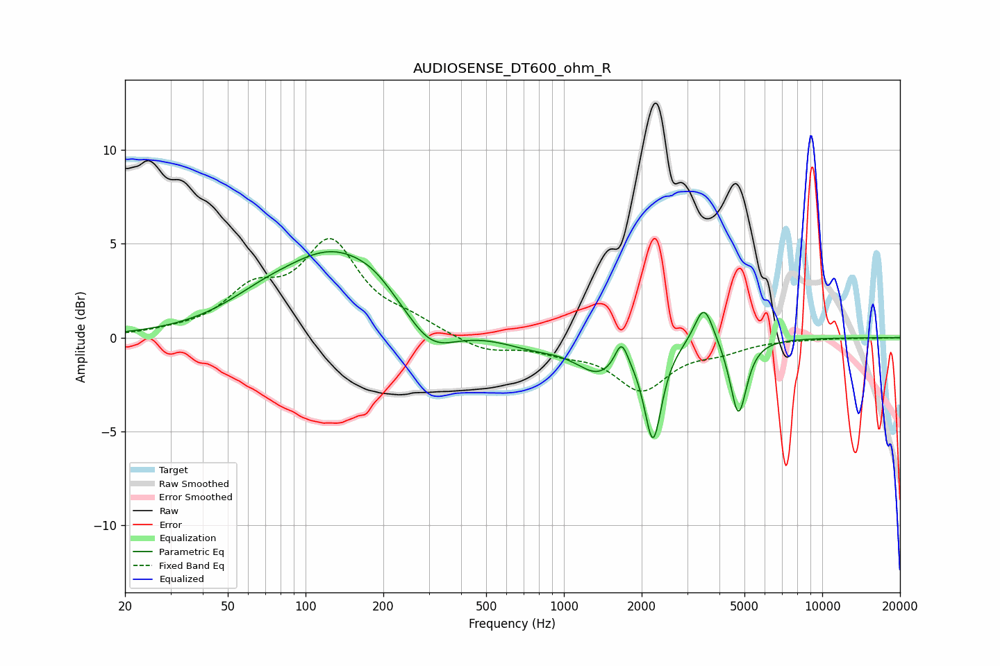

# AUDIOSENSE_DT600_ohm_R
See [usage instructions](https://github.com/jaakkopasanen/AutoEq#usage) for more options and info.

### Parametric EQs
Apply preamp of -4.7 dB when using parametric equalizer.

|   # | Type    |   Fc (Hz) |    Q |   Gain (dB) |
|-----|---------|-----------|------|-------------|
|   1 | Peaking |        67 | 1    |         0.7 |
|   2 | Peaking |       132 | 0.64 |         4.5 |
|   3 | Peaking |       184 | 2.09 |         0.3 |
|   4 | Peaking |       305 | 1.44 |        -1.9 |
|   5 | Peaking |       754 | 1.23 |        -0.5 |
|   6 | Peaking |      1362 | 1.59 |        -1.7 |
|   7 | Peaking |      1671 | 5.64 |         1.4 |
|   8 | Peaking |      2214 | 4.32 |        -5.1 |
|   9 | Peaking |      3487 | 3.85 |         2.2 |
|  10 | Peaking |      4737 | 4.42 |        -4.1 |

### Fixed Band EQs
When using fixed band (also called graphic) equalizer, apply preamp of **-5.4 dB** (if available) and set gains manually with these parameters.

|   # | Type    |   Fc (Hz) |    Q |   Gain (dB) |
|-----|---------|-----------|------|-------------|
|   1 | Peaking |        31 | 1.41 |         0.2 |
|   2 | Peaking |        62 | 1.41 |         2.2 |
|   3 | Peaking |       125 | 1.41 |         4.8 |
|   4 | Peaking |       250 | 1.41 |         0.7 |
|   5 | Peaking |       500 | 1.41 |        -0.7 |
|   6 | Peaking |      1000 | 1.41 |        -0.6 |
|   7 | Peaking |      2000 | 1.41 |        -2.6 |
|   8 | Peaking |      4000 | 1.41 |        -0.6 |
|   9 | Peaking |      8000 | 1.41 |        -0   |
|  10 | Peaking |     16000 | 1.41 |        -0   |

### Graphs

