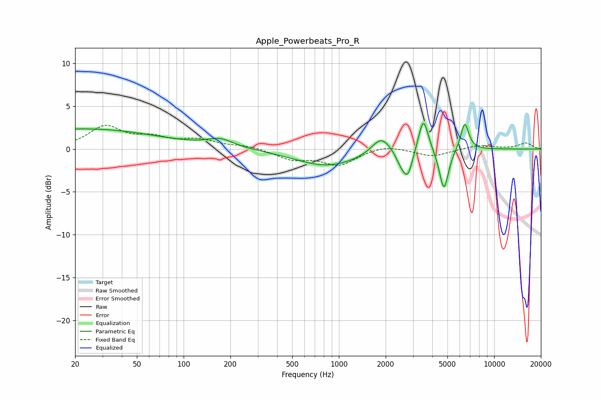

# Apple_Powerbeats_Pro_R
See [usage instructions](https://github.com/jaakkopasanen/AutoEq#usage) for more options and info.

### Parametric EQs
Apply preamp of -3.1 dB when using parametric equalizer.

|   # | Type    |   Fc (Hz) |    Q |   Gain (dB) |
|-----|---------|-----------|------|-------------|
|   1 | Peaking |        21 | 5.48 |         0   |
|   2 | Peaking |        23 | 0.29 |         2.3 |
|   3 | Peaking |       172 | 1.66 |         1   |
|   4 | Peaking |       845 | 0.68 |        -2   |
|   5 | Peaking |      1875 | 2.34 |         2.1 |
|   6 | Peaking |      2530 | 3.8  |        -1.4 |
|   7 | Peaking |      2784 | 4.58 |        -2.7 |
|   8 | Peaking |      3500 | 4.48 |         4.1 |
|   9 | Peaking |      4747 | 4.78 |        -4.9 |
|  10 | Peaking |      6465 | 5.2  |         3.3 |

### Fixed Band EQs
When using fixed band (also called graphic) equalizer, apply preamp of **-2.9 dB** (if available) and set gains manually with these parameters.

|   # | Type    |   Fc (Hz) |    Q |   Gain (dB) |
|-----|---------|-----------|------|-------------|
|   1 | Peaking |        31 | 1.41 |         2.5 |
|   2 | Peaking |        62 | 1.41 |         1.1 |
|   3 | Peaking |       125 | 1.41 |         0.9 |
|   4 | Peaking |       250 | 1.41 |         0.4 |
|   5 | Peaking |       500 | 1.41 |        -1.1 |
|   6 | Peaking |      1000 | 1.41 |        -1.8 |
|   7 | Peaking |      2000 | 1.41 |         0.5 |
|   8 | Peaking |      4000 | 1.41 |        -0.9 |
|   9 | Peaking |      8000 | 1.41 |         0.5 |
|  10 | Peaking |     16000 | 1.41 |         0.7 |

### Graphs

