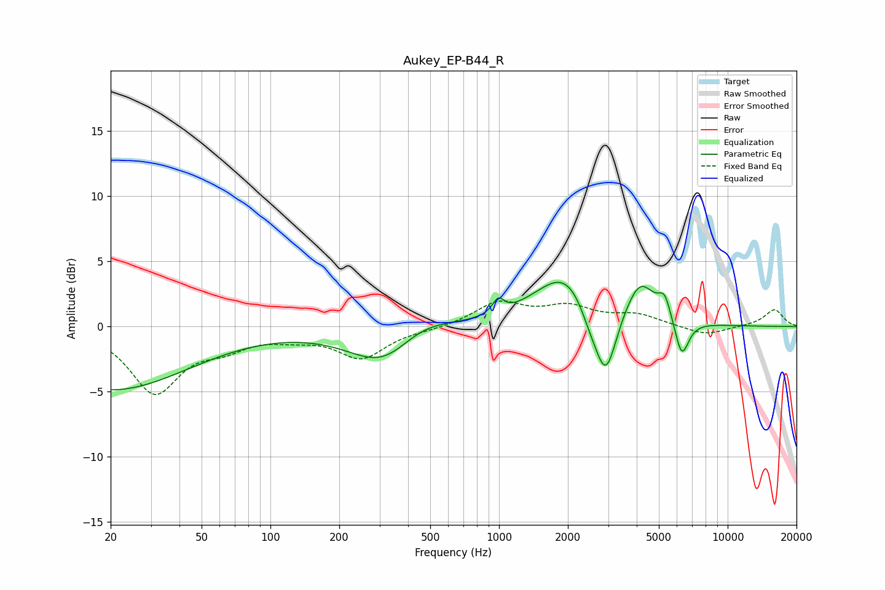

# Aukey_EP-B44_R
See [usage instructions](https://github.com/jaakkopasanen/AutoEq#usage) for more options and info.

### Parametric EQs
Apply preamp of -3.5 dB when using parametric equalizer.

|   # | Type    |   Fc (Hz) |    Q |   Gain (dB) |
|-----|---------|-----------|------|-------------|
|   1 | Peaking |        20 | 0.41 |        -4.8 |
|   2 | Peaking |       320 | 0.91 |        -3.5 |
|   3 | Peaking |       438 | 1    |         1.8 |
|   4 | Peaking |       992 | 5.9  |         1.1 |
|   5 | Peaking |      1995 | 1.03 |         4.4 |
|   6 | Peaking |      2497 | 2.85 |        -1.6 |
|   7 | Peaking |      2932 | 2.93 |        -5.5 |
|   8 | Peaking |      4146 | 2.26 |         3   |
|   9 | Peaking |      5302 | 4.93 |         1.7 |
|  10 | Peaking |      6294 | 4.46 |        -2.9 |

### Fixed Band EQs
When using fixed band (also called graphic) equalizer, apply preamp of **-2.1 dB** (if available) and set gains manually with these parameters.

|   # | Type    |   Fc (Hz) |    Q |   Gain (dB) |
|-----|---------|-----------|------|-------------|
|   1 | Peaking |        31 | 1.41 |        -4.9 |
|   2 | Peaking |        62 | 1.41 |        -1.2 |
|   3 | Peaking |       125 | 1.41 |        -0.6 |
|   4 | Peaking |       250 | 1.41 |        -2.3 |
|   5 | Peaking |       500 | 1.41 |        -0.2 |
|   6 | Peaking |      1000 | 1.41 |         1.8 |
|   7 | Peaking |      2000 | 1.41 |         1.4 |
|   8 | Peaking |      4000 | 1.41 |         0.8 |
|   9 | Peaking |      8000 | 1.41 |        -0.7 |
|  10 | Peaking |     16000 | 1.41 |         1.3 |

### Graphs

