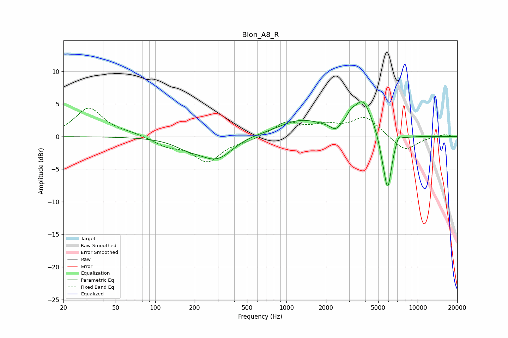

# Blon_A8_R
See [usage instructions](https://github.com/jaakkopasanen/AutoEq#usage) for more options and info.

### Parametric EQs
Apply preamp of -5.4 dB when using parametric equalizer.

|   # | Type    |   Fc (Hz) |    Q |   Gain (dB) |
|-----|---------|-----------|------|-------------|
|   1 | Peaking |       175 | 1.44 |        -0.9 |
|   2 | Peaking |       295 | 1.06 |        -3.6 |
|   3 | Peaking |       463 | 1.1  |         0.4 |
|   4 | Peaking |      1287 | 0.79 |         2.5 |
|   5 | Peaking |      2361 | 4.07 |        -1   |
|   6 | Peaking |      3090 | 4.95 |         0.9 |
|   7 | Peaking |      3814 | 1.96 |         5.3 |
|   8 | Peaking |      5302 | 6    |        -1   |
|   9 | Peaking |      5901 | 4.28 |        -8.8 |
|  10 | Peaking |      7166 | 6    |         1.1 |

### Fixed Band EQs
When using fixed band (also called graphic) equalizer, apply preamp of **-4.5 dB** (if available) and set gains manually with these parameters.

|   # | Type    |   Fc (Hz) |    Q |   Gain (dB) |
|-----|---------|-----------|------|-------------|
|   1 | Peaking |        31 | 1.41 |         4.4 |
|   2 | Peaking |        62 | 1.41 |         0.4 |
|   3 | Peaking |       125 | 1.41 |        -1.3 |
|   4 | Peaking |       250 | 1.41 |        -3.7 |
|   5 | Peaking |       500 | 1.41 |        -0.5 |
|   6 | Peaking |      1000 | 1.41 |         2.1 |
|   7 | Peaking |      2000 | 1.41 |         1.4 |
|   8 | Peaking |      4000 | 1.41 |         2.9 |
|   9 | Peaking |      8000 | 1.41 |        -2.3 |
|  10 | Peaking |     16000 | 1.41 |         0.4 |

### Graphs

