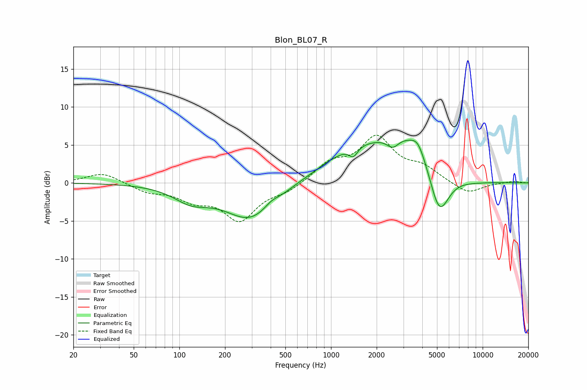

# Blon_BL07_R
See [usage instructions](https://github.com/jaakkopasanen/AutoEq#usage) for more options and info.

### Parametric EQs
Apply preamp of -5.7 dB when using parametric equalizer.

|   # | Type    |   Fc (Hz) |    Q |   Gain (dB) |
|-----|---------|-----------|------|-------------|
|   1 | Peaking |       120 | 1.21 |        -1.9 |
|   2 | Peaking |       296 | 0.83 |        -4.8 |
|   3 | Peaking |       402 | 3.07 |         0.6 |
|   4 | Peaking |      1356 | 0.65 |         3.1 |
|   5 | Peaking |      1405 | 5.17 |        -1.3 |
|   6 | Peaking |      2555 | 3.64 |        -1.3 |
|   7 | Peaking |      3343 | 0.64 |         5.7 |
|   8 | Peaking |      3743 | 3.17 |         1.6 |
|   9 | Peaking |      5164 | 2.01 |        -7.2 |
|  10 | Peaking |      7594 | 0.81 |        -0.9 |

### Fixed Band EQs
When using fixed band (also called graphic) equalizer, apply preamp of **-6.4 dB** (if available) and set gains manually with these parameters.

|   # | Type    |   Fc (Hz) |    Q |   Gain (dB) |
|-----|---------|-----------|------|-------------|
|   1 | Peaking |        31 | 1.41 |         1.4 |
|   2 | Peaking |        62 | 1.41 |        -1.1 |
|   3 | Peaking |       125 | 1.41 |        -1.9 |
|   4 | Peaking |       250 | 1.41 |        -4.7 |
|   5 | Peaking |       500 | 1.41 |        -1   |
|   6 | Peaking |      1000 | 1.41 |         2.4 |
|   7 | Peaking |      2000 | 1.41 |         5.7 |
|   8 | Peaking |      4000 | 1.41 |         1.7 |
|   9 | Peaking |      8000 | 1.41 |        -1.5 |
|  10 | Peaking |     16000 | 1.41 |         0.2 |

### Graphs

