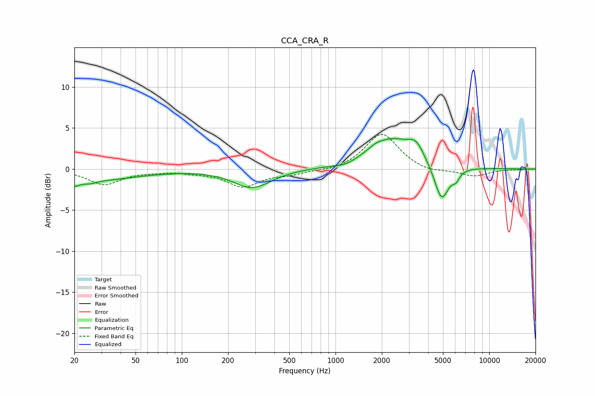

# CCA_CRA_R
See [usage instructions](https://github.com/jaakkopasanen/AutoEq#usage) for more options and info.

### Parametric EQs
Apply preamp of -3.8 dB when using parametric equalizer.

|   # | Type    |   Fc (Hz) |    Q |   Gain (dB) |
|-----|---------|-----------|------|-------------|
|   1 | Peaking |        20 | 4.68 |        -0.7 |
|   2 | Peaking |        25 | 3.5  |        -0.3 |
|   3 | Peaking |        25 | 0.47 |        -1.4 |
|   4 | Peaking |       287 | 1.17 |        -2.3 |
|   5 | Peaking |      1173 | 1.97 |        -0.5 |
|   6 | Peaking |      1836 | 3.43 |         0.3 |
|   7 | Peaking |      2347 | 0.89 |         3.6 |
|   8 | Peaking |      3344 | 2.96 |         1.6 |
|   9 | Peaking |      4896 | 2.9  |        -4.6 |
|  10 | Peaking |      6082 | 5.99 |        -0.9 |

### Fixed Band EQs
When using fixed band (also called graphic) equalizer, apply preamp of **-4.3 dB** (if available) and set gains manually with these parameters.

|   # | Type    |   Fc (Hz) |    Q |   Gain (dB) |
|-----|---------|-----------|------|-------------|
|   1 | Peaking |        31 | 1.41 |        -1.8 |
|   2 | Peaking |        62 | 1.41 |        -0.2 |
|   3 | Peaking |       125 | 1.41 |        -0.3 |
|   4 | Peaking |       250 | 1.41 |        -2.1 |
|   5 | Peaking |       500 | 1.41 |        -0.5 |
|   6 | Peaking |      1000 | 1.41 |        -0.3 |
|   7 | Peaking |      2000 | 1.41 |         4.4 |
|   8 | Peaking |      4000 | 1.41 |        -0.5 |
|   9 | Peaking |      8000 | 1.41 |        -0.9 |
|  10 | Peaking |     16000 | 1.41 |        -0   |

### Graphs

