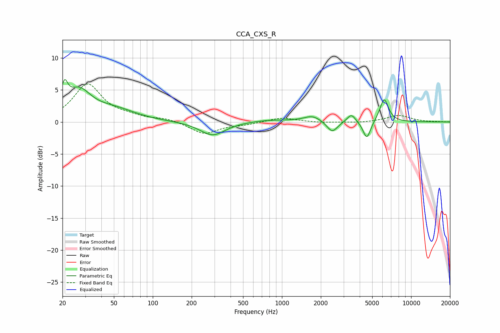

# CCA_CXS_R
See [usage instructions](https://github.com/jaakkopasanen/AutoEq#usage) for more options and info.

### Parametric EQs
Apply preamp of -6.7 dB when using parametric equalizer.

|   # | Type    |   Fc (Hz) |    Q |   Gain (dB) |
|-----|---------|-----------|------|-------------|
|   1 | Peaking |        21 | 5.54 |         3.4 |
|   2 | Peaking |        27 | 1.5  |         4.3 |
|   3 | Peaking |        50 | 0.84 |         1.7 |
|   4 | Peaking |       290 | 1.46 |        -2.1 |
|   5 | Peaking |       803 | 0.9  |         0.3 |
|   6 | Peaking |      1722 | 2.14 |         0.9 |
|   7 | Peaking |      2449 | 3.47 |        -1.8 |
|   8 | Peaking |      3445 | 4.36 |         1.3 |
|   9 | Peaking |      4542 | 4.79 |        -2.8 |
|  10 | Peaking |      6183 | 4.12 |         3.7 |

### Fixed Band EQs
When using fixed band (also called graphic) equalizer, apply preamp of **-6.0 dB** (if available) and set gains manually with these parameters.

|   # | Type    |   Fc (Hz) |    Q |   Gain (dB) |
|-----|---------|-----------|------|-------------|
|   1 | Peaking |        31 | 1.41 |         5.8 |
|   2 | Peaking |        62 | 1.41 |         0.6 |
|   3 | Peaking |       125 | 1.41 |         0.5 |
|   4 | Peaking |       250 | 1.41 |        -1.9 |
|   5 | Peaking |       500 | 1.41 |        -0.3 |
|   6 | Peaking |      1000 | 1.41 |         0.7 |
|   7 | Peaking |      2000 | 1.41 |        -0.1 |
|   8 | Peaking |      4000 | 1.41 |        -0.1 |
|   9 | Peaking |      8000 | 1.41 |         1   |
|  10 | Peaking |     16000 | 1.41 |         0   |

### Graphs

