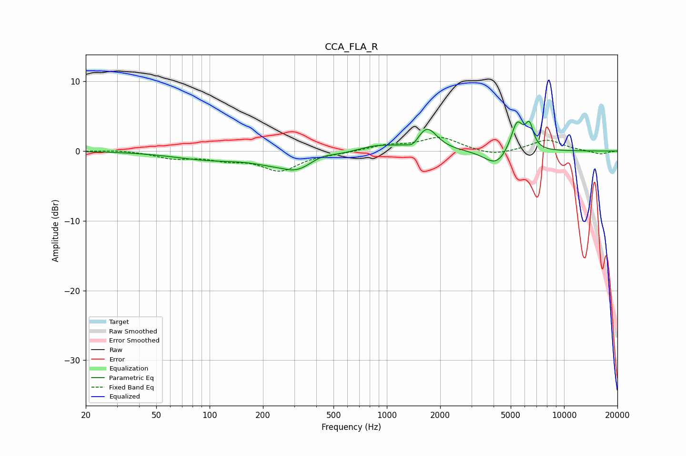

# CCA_FLA_R
See [usage instructions](https://github.com/jaakkopasanen/AutoEq#usage) for more options and info.

### Parametric EQs
Apply preamp of -4.4 dB when using parametric equalizer.

|   # | Type    |   Fc (Hz) |    Q |   Gain (dB) |
|-----|---------|-----------|------|-------------|
|   1 | Peaking |        98 | 0.7  |        -1   |
|   2 | Peaking |       257 | 2.05 |         0.6 |
|   3 | Peaking |       296 | 1.04 |        -3.3 |
|   4 | Peaking |       418 | 1.92 |         1   |
|   5 | Peaking |       875 | 1.33 |         0.9 |
|   6 | Peaking |      1403 | 4.89 |        -0.8 |
|   7 | Peaking |      1689 | 2.53 |         3.2 |
|   8 | Peaking |      4145 | 2.1  |        -2.3 |
|   9 | Peaking |      5427 | 3.96 |         4.4 |
|  10 | Peaking |      6376 | 6    |         3.2 |

### Fixed Band EQs
When using fixed band (also called graphic) equalizer, apply preamp of **-2.0 dB** (if available) and set gains manually with these parameters.

|   # | Type    |   Fc (Hz) |    Q |   Gain (dB) |
|-----|---------|-----------|------|-------------|
|   1 | Peaking |        31 | 1.41 |         0.2 |
|   2 | Peaking |        62 | 1.41 |        -0.9 |
|   3 | Peaking |       125 | 1.41 |        -1   |
|   4 | Peaking |       250 | 1.41 |        -2.7 |
|   5 | Peaking |       500 | 1.41 |        -0.2 |
|   6 | Peaking |      1000 | 1.41 |         0.8 |
|   7 | Peaking |      2000 | 1.41 |         1.9 |
|   8 | Peaking |      4000 | 1.41 |        -0.8 |
|   9 | Peaking |      8000 | 1.41 |         1.6 |
|  10 | Peaking |     16000 | 1.41 |        -0.5 |

### Graphs

