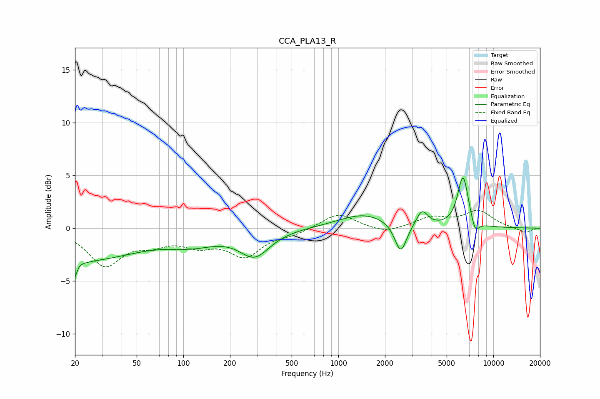

# CCA_PLA13_R
See [usage instructions](https://github.com/jaakkopasanen/AutoEq#usage) for more options and info.

### Parametric EQs
Apply preamp of -4.9 dB when using parametric equalizer.

|   # | Type    |   Fc (Hz) |    Q |   Gain (dB) |
|-----|---------|-----------|------|-------------|
|   1 | Peaking |        20 | 5.85 |        -2.9 |
|   2 | Peaking |        20 | 0.35 |        -3   |
|   3 | Peaking |        21 | 6    |         1.5 |
|   4 | Peaking |       115 | 0.87 |        -1.1 |
|   5 | Peaking |       288 | 1.45 |        -2.4 |
|   6 | Peaking |      1462 | 0.87 |         1.3 |
|   7 | Peaking |      2527 | 3.68 |        -2.9 |
|   8 | Peaking |      3465 | 3.9  |         1.5 |
|   9 | Peaking |      6379 | 3.93 |         4.9 |
|  10 | Peaking |      7633 | 5.27 |        -1.3 |

### Fixed Band EQs
When using fixed band (also called graphic) equalizer, apply preamp of **-1.8 dB** (if available) and set gains manually with these parameters.

|   # | Type    |   Fc (Hz) |    Q |   Gain (dB) |
|-----|---------|-----------|------|-------------|
|   1 | Peaking |        31 | 1.41 |        -3.4 |
|   2 | Peaking |        62 | 1.41 |        -1.1 |
|   3 | Peaking |       125 | 1.41 |        -1.3 |
|   4 | Peaking |       250 | 1.41 |        -2.5 |
|   5 | Peaking |       500 | 1.41 |        -0.5 |
|   6 | Peaking |      1000 | 1.41 |         1.5 |
|   7 | Peaking |      2000 | 1.41 |        -0.5 |
|   8 | Peaking |      4000 | 1.41 |         1   |
|   9 | Peaking |      8000 | 1.41 |         1.6 |
|  10 | Peaking |     16000 | 1.41 |        -0.5 |

### Graphs

