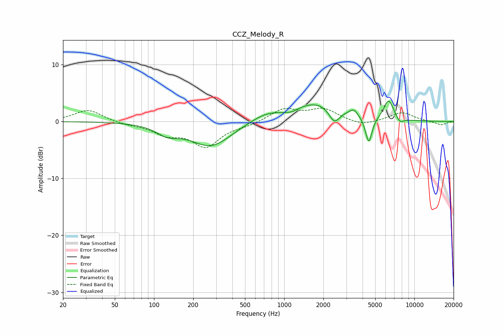

# CCZ_Melody_R
See [usage instructions](https://github.com/jaakkopasanen/AutoEq#usage) for more options and info.

### Parametric EQs
Apply preamp of -3.7 dB when using parametric equalizer.

|   # | Type    |   Fc (Hz) |    Q |   Gain (dB) |
|-----|---------|-----------|------|-------------|
|   1 | Peaking |       127 | 1.7  |        -1.6 |
|   2 | Peaking |       274 | 0.89 |        -4.3 |
|   3 | Peaking |       712 | 1.13 |         1.2 |
|   4 | Peaking |      1125 | 2.4  |        -0.7 |
|   5 | Peaking |      1754 | 0.74 |         3.4 |
|   6 | Peaking |      2427 | 3.46 |        -2.6 |
|   7 | Peaking |      3413 | 4.36 |         1.1 |
|   8 | Peaking |      4463 | 5.53 |        -4.7 |
|   9 | Peaking |      6346 | 3.59 |         3.6 |
|  10 | Peaking |      7749 | 4.74 |        -1   |

### Fixed Band EQs
When using fixed band (also called graphic) equalizer, apply preamp of **-2.4 dB** (if available) and set gains manually with these parameters.

|   # | Type    |   Fc (Hz) |    Q |   Gain (dB) |
|-----|---------|-----------|------|-------------|
|   1 | Peaking |        31 | 1.41 |         2.1 |
|   2 | Peaking |        62 | 1.41 |        -0.5 |
|   3 | Peaking |       125 | 1.41 |        -2   |
|   4 | Peaking |       250 | 1.41 |        -4.2 |
|   5 | Peaking |       500 | 1.41 |        -0.6 |
|   6 | Peaking |      1000 | 1.41 |         2.2 |
|   7 | Peaking |      2000 | 1.41 |         2.1 |
|   8 | Peaking |      4000 | 1.41 |        -0.8 |
|   9 | Peaking |      8000 | 1.41 |         1.6 |
|  10 | Peaking |     16000 | 1.41 |        -0.6 |

### Graphs

