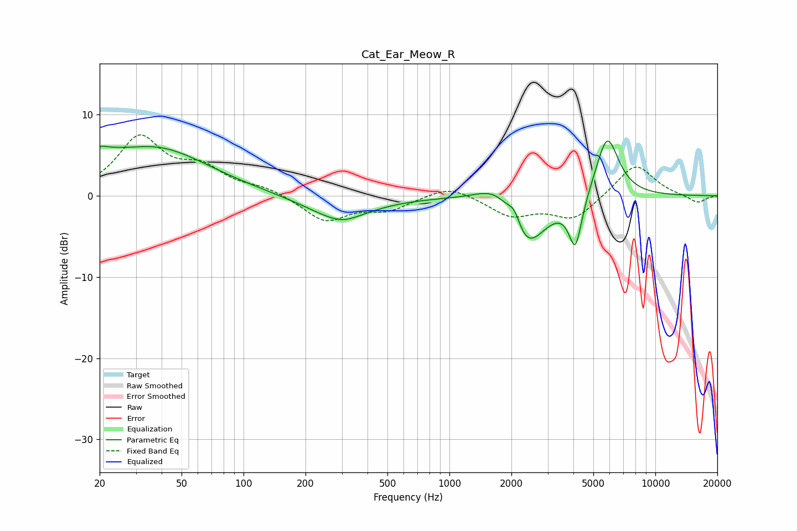

# Cat_Ear_Meow_R
See [usage instructions](https://github.com/jaakkopasanen/AutoEq#usage) for more options and info.

### Parametric EQs
Apply preamp of -6.8 dB when using parametric equalizer.

|   # | Type    |   Fc (Hz) |    Q |   Gain (dB) |
|-----|---------|-----------|------|-------------|
|   1 | Peaking |        20 | 5.9  |         0.6 |
|   2 | Peaking |        21 | 1.7  |         1.7 |
|   3 | Peaking |        37 | 0.54 |         5.8 |
|   4 | Peaking |       288 | 0.88 |        -2.9 |
|   5 | Peaking |       306 | 2.41 |        -0.4 |
|   6 | Peaking |      1727 | 1.43 |         3.4 |
|   7 | Peaking |      2068 | 4.55 |         2.1 |
|   8 | Peaking |      2336 | 1.45 |        -7.6 |
|   9 | Peaking |      4093 | 4.41 |        -6.2 |
|  10 | Peaking |      5838 | 2.43 |         7.8 |

### Fixed Band EQs
When using fixed band (also called graphic) equalizer, apply preamp of **-7.6 dB** (if available) and set gains manually with these parameters.

|   # | Type    |   Fc (Hz) |    Q |   Gain (dB) |
|-----|---------|-----------|------|-------------|
|   1 | Peaking |        31 | 1.41 |         6.9 |
|   2 | Peaking |        62 | 1.41 |         2.9 |
|   3 | Peaking |       125 | 1.41 |         0.9 |
|   4 | Peaking |       250 | 1.41 |        -3.1 |
|   5 | Peaking |       500 | 1.41 |        -1.6 |
|   6 | Peaking |      1000 | 1.41 |         1.4 |
|   7 | Peaking |      2000 | 1.41 |        -2.4 |
|   8 | Peaking |      4000 | 1.41 |        -2.9 |
|   9 | Peaking |      8000 | 1.41 |         4   |
|  10 | Peaking |     16000 | 1.41 |        -0.9 |

### Graphs

