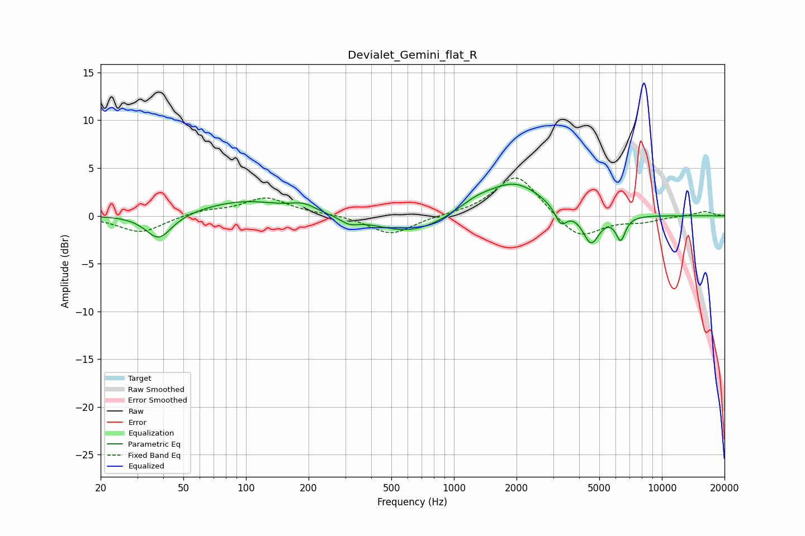

# Devialet_Gemini_flat_R
See [usage instructions](https://github.com/jaakkopasanen/AutoEq#usage) for more options and info.

### Parametric EQs
Apply preamp of -3.4 dB when using parametric equalizer.

|   # | Type    |   Fc (Hz) |    Q |   Gain (dB) |
|-----|---------|-----------|------|-------------|
|   1 | Peaking |        38 | 2.26 |        -2.7 |
|   2 | Peaking |        98 | 0.7  |         1.6 |
|   3 | Peaking |       189 | 2.28 |         0.8 |
|   4 | Peaking |       314 | 3.28 |        -0.7 |
|   5 | Peaking |       620 | 0.85 |        -1.9 |
|   6 | Peaking |      1280 | 1.61 |         1   |
|   7 | Peaking |      1966 | 1.04 |         3.4 |
|   8 | Peaking |      3269 | 4.95 |        -1.8 |
|   9 | Peaking |      4564 | 3.53 |        -3.2 |
|  10 | Peaking |      6333 | 6    |        -2.4 |

### Fixed Band EQs
When using fixed band (also called graphic) equalizer, apply preamp of **-4.1 dB** (if available) and set gains manually with these parameters.

|   # | Type    |   Fc (Hz) |    Q |   Gain (dB) |
|-----|---------|-----------|------|-------------|
|   1 | Peaking |        31 | 1.41 |        -1.8 |
|   2 | Peaking |        62 | 1.41 |         0.5 |
|   3 | Peaking |       125 | 1.41 |         1.9 |
|   4 | Peaking |       250 | 1.41 |         0.1 |
|   5 | Peaking |       500 | 1.41 |        -2   |
|   6 | Peaking |      1000 | 1.41 |         0.1 |
|   7 | Peaking |      2000 | 1.41 |         4.5 |
|   8 | Peaking |      4000 | 1.41 |        -2.6 |
|   9 | Peaking |      8000 | 1.41 |        -0.5 |
|  10 | Peaking |     16000 | 1.41 |         0.5 |

### Graphs

