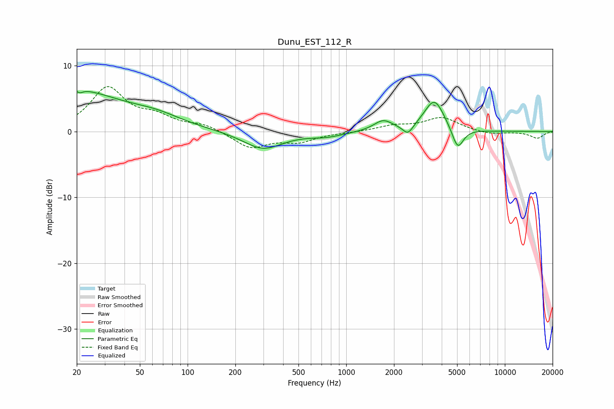

# Dunu_EST_112_R
See [usage instructions](https://github.com/jaakkopasanen/AutoEq#usage) for more options and info.

### Parametric EQs
Apply preamp of -6.2 dB when using parametric equalizer.

|   # | Type    |   Fc (Hz) |    Q |   Gain (dB) |
|-----|---------|-----------|------|-------------|
|   1 | Peaking |        20 | 0.51 |         5.9 |
|   2 | Peaking |        21 | 5.25 |         3.6 |
|   3 | Peaking |        21 | 5.7  |        -3.9 |
|   4 | Peaking |        63 | 0.82 |         1.6 |
|   5 | Peaking |       298 | 1.14 |        -2.7 |
|   6 | Peaking |       752 | 1.33 |        -0.7 |
|   7 | Peaking |      1709 | 2.41 |         1.6 |
|   8 | Peaking |      2450 | 4.47 |        -1.5 |
|   9 | Peaking |      3593 | 2.21 |         4.8 |
|  10 | Peaking |      5042 | 3.83 |        -3.4 |

### Fixed Band EQs
When using fixed band (also called graphic) equalizer, apply preamp of **-6.9 dB** (if available) and set gains manually with these parameters.

|   # | Type    |   Fc (Hz) |    Q |   Gain (dB) |
|-----|---------|-----------|------|-------------|
|   1 | Peaking |        31 | 1.41 |         6.5 |
|   2 | Peaking |        62 | 1.41 |         1.9 |
|   3 | Peaking |       125 | 1.41 |         1   |
|   4 | Peaking |       250 | 1.41 |        -2.5 |
|   5 | Peaking |       500 | 1.41 |        -1.4 |
|   6 | Peaking |      1000 | 1.41 |        -0.1 |
|   7 | Peaking |      2000 | 1.41 |         0.8 |
|   8 | Peaking |      4000 | 1.41 |         2.1 |
|   9 | Peaking |      8000 | 1.41 |        -0.5 |
|  10 | Peaking |     16000 | 1.41 |        -1   |

### Graphs

