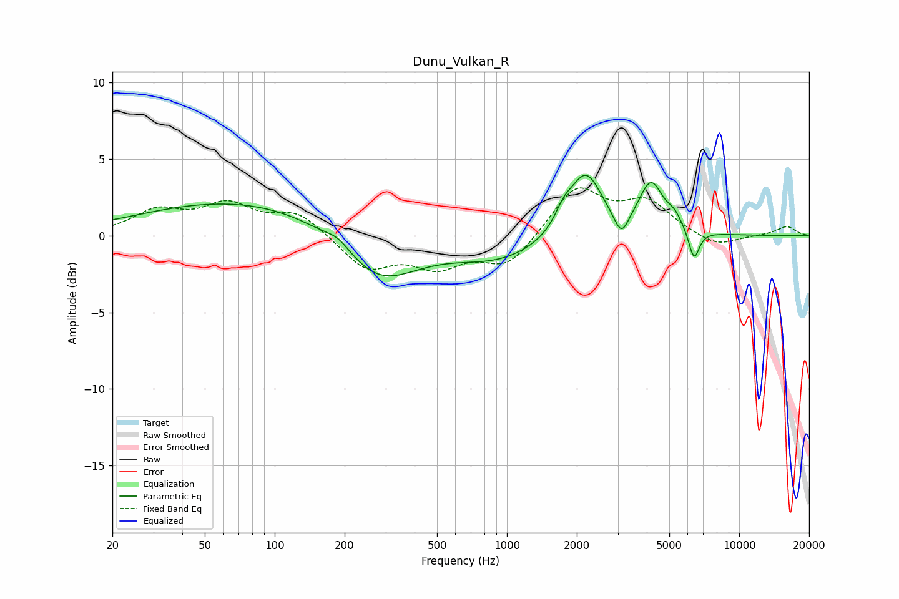

# Dunu_Vulkan_R
See [usage instructions](https://github.com/jaakkopasanen/AutoEq#usage) for more options and info.

### Parametric EQs
Apply preamp of -4.0 dB when using parametric equalizer.

|   # | Type    |   Fc (Hz) |    Q |   Gain (dB) |
|-----|---------|-----------|------|-------------|
|   1 | Peaking |        75 | 0.31 |         2.4 |
|   2 | Peaking |       188 | 2.67 |         0.6 |
|   3 | Peaking |       278 | 0.83 |        -3.4 |
|   4 | Peaking |       923 | 0.7  |        -1.5 |
|   5 | Peaking |      1752 | 3.79 |         1   |
|   6 | Peaking |      2183 | 1.97 |         4.2 |
|   7 | Peaking |      3112 | 4.61 |        -1.5 |
|   8 | Peaking |      4171 | 2.68 |         3.2 |
|   9 | Peaking |      5269 | 4.09 |         0.8 |
|  10 | Peaking |      6389 | 5.97 |        -2   |

### Fixed Band EQs
When using fixed band (also called graphic) equalizer, apply preamp of **-3.2 dB** (if available) and set gains manually with these parameters.

|   # | Type    |   Fc (Hz) |    Q |   Gain (dB) |
|-----|---------|-----------|------|-------------|
|   1 | Peaking |        31 | 1.41 |         1.5 |
|   2 | Peaking |        62 | 1.41 |         1.8 |
|   3 | Peaking |       125 | 1.41 |         1.5 |
|   4 | Peaking |       250 | 1.41 |        -2.1 |
|   5 | Peaking |       500 | 1.41 |        -1.8 |
|   6 | Peaking |      1000 | 1.41 |        -2   |
|   7 | Peaking |      2000 | 1.41 |         3.2 |
|   8 | Peaking |      4000 | 1.41 |         2.1 |
|   9 | Peaking |      8000 | 1.41 |        -0.8 |
|  10 | Peaking |     16000 | 1.41 |         0.6 |

### Graphs

