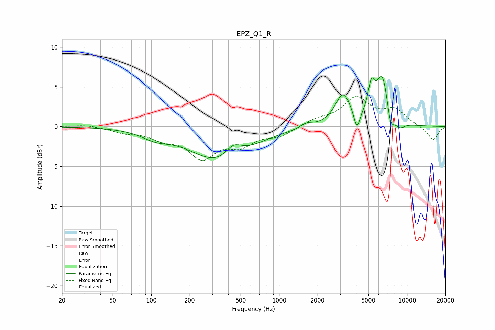

# EPZ_Q1_R
See [usage instructions](https://github.com/jaakkopasanen/AutoEq#usage) for more options and info.

### Parametric EQs
Apply preamp of -6.4 dB when using parametric equalizer.

|   # | Type    |   Fc (Hz) |    Q |   Gain (dB) |
|-----|---------|-----------|------|-------------|
|   1 | Peaking |       108 | 1.3  |        -1   |
|   2 | Peaking |       349 | 0.62 |        -4.4 |
|   3 | Peaking |       439 | 2.15 |         1.7 |
|   4 | Peaking |      1648 | 2.98 |         0.6 |
|   5 | Peaking |      3158 | 2.29 |         3.9 |
|   6 | Peaking |      4056 | 6    |        -2.4 |
|   7 | Peaking |      5260 | 5.35 |         3.3 |
|   8 | Peaking |      6445 | 2.61 |         6.5 |
|   9 | Peaking |      7414 | 4.37 |        -2.8 |
|  10 | Peaking |      8762 | 3.02 |        -1   |

### Fixed Band EQs
When using fixed band (also called graphic) equalizer, apply preamp of **-3.9 dB** (if available) and set gains manually with these parameters.

|   # | Type    |   Fc (Hz) |    Q |   Gain (dB) |
|-----|---------|-----------|------|-------------|
|   1 | Peaking |        31 | 1.41 |         0.3 |
|   2 | Peaking |        62 | 1.41 |        -0.6 |
|   3 | Peaking |       125 | 1.41 |        -1.2 |
|   4 | Peaking |       250 | 1.41 |        -3.6 |
|   5 | Peaking |       500 | 1.41 |        -2   |
|   6 | Peaking |      1000 | 1.41 |        -1.1 |
|   7 | Peaking |      2000 | 1.41 |         0.8 |
|   8 | Peaking |      4000 | 1.41 |         3.4 |
|   9 | Peaking |      8000 | 1.41 |         1.9 |
|  10 | Peaking |     16000 | 1.41 |        -1.7 |

### Graphs

