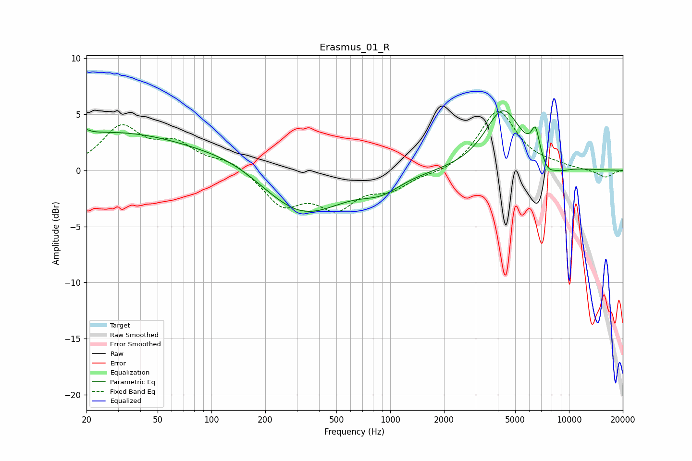

# Erasmus_01_R
See [usage instructions](https://github.com/jaakkopasanen/AutoEq#usage) for more options and info.

### Parametric EQs
Apply preamp of -5.4 dB when using parametric equalizer.

|   # | Type    |   Fc (Hz) |    Q |   Gain (dB) |
|-----|---------|-----------|------|-------------|
|   1 | Peaking |        20 | 5.84 |         3.1 |
|   2 | Peaking |        20 | 6    |        -2.7 |
|   3 | Peaking |        28 | 0.31 |         3.3 |
|   4 | Peaking |       135 | 0.7  |         0.9 |
|   5 | Peaking |       321 | 0.63 |        -4.1 |
|   6 | Peaking |       888 | 1.3  |        -1.2 |
|   7 | Peaking |      4283 | 1.39 |         5.4 |
|   8 | Peaking |      6499 | 5.98 |         2.4 |
|   9 | Peaking |      7593 | 3.4  |        -1   |
|  10 | Peaking |      8914 | 2.11 |        -0.5 |

### Fixed Band EQs
When using fixed band (also called graphic) equalizer, apply preamp of **-5.3 dB** (if available) and set gains manually with these parameters.

|   # | Type    |   Fc (Hz) |    Q |   Gain (dB) |
|-----|---------|-----------|------|-------------|
|   1 | Peaking |        31 | 1.41 |         3.7 |
|   2 | Peaking |        62 | 1.41 |         2.1 |
|   3 | Peaking |       125 | 1.41 |         0.9 |
|   4 | Peaking |       250 | 1.41 |        -3   |
|   5 | Peaking |       500 | 1.41 |        -3   |
|   6 | Peaking |      1000 | 1.41 |        -1.5 |
|   7 | Peaking |      2000 | 1.41 |        -0.3 |
|   8 | Peaking |      4000 | 1.41 |         5.3 |
|   9 | Peaking |      8000 | 1.41 |         0.3 |
|  10 | Peaking |     16000 | 1.41 |        -0.7 |

### Graphs

