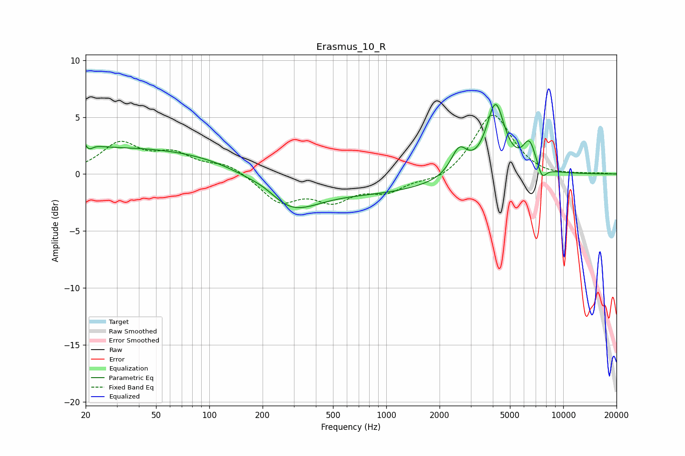

# Erasmus_10_R
See [usage instructions](https://github.com/jaakkopasanen/AutoEq#usage) for more options and info.

### Parametric EQs
Apply preamp of -6.2 dB when using parametric equalizer.

|   # | Type    |   Fc (Hz) |    Q |   Gain (dB) |
|-----|---------|-----------|------|-------------|
|   1 | Peaking |        20 | 3.89 |         2.1 |
|   2 | Peaking |        21 | 5.29 |        -1.9 |
|   3 | Peaking |        35 | 0.2  |         2.3 |
|   4 | Peaking |       211 | 1.52 |         0.8 |
|   5 | Peaking |       275 | 0.83 |        -3.4 |
|   6 | Peaking |       933 | 0.43 |        -1.4 |
|   7 | Peaking |      2579 | 3.03 |         2.3 |
|   8 | Peaking |      4142 | 2.72 |         6.1 |
|   9 | Peaking |      6443 | 3.72 |         2.4 |
|  10 | Peaking |      7582 | 5.33 |        -1.2 |

### Fixed Band EQs
When using fixed band (also called graphic) equalizer, apply preamp of **-5.3 dB** (if available) and set gains manually with these parameters.

|   # | Type    |   Fc (Hz) |    Q |   Gain (dB) |
|-----|---------|-----------|------|-------------|
|   1 | Peaking |        31 | 1.41 |         2.6 |
|   2 | Peaking |        62 | 1.41 |         1.6 |
|   3 | Peaking |       125 | 1.41 |         0.9 |
|   4 | Peaking |       250 | 1.41 |        -2.3 |
|   5 | Peaking |       500 | 1.41 |        -2   |
|   6 | Peaking |      1000 | 1.41 |        -1.4 |
|   7 | Peaking |      2000 | 1.41 |        -0.7 |
|   8 | Peaking |      4000 | 1.41 |         5.4 |
|   9 | Peaking |      8000 | 1.41 |        -0.3 |
|  10 | Peaking |     16000 | 1.41 |         0.1 |

### Graphs

