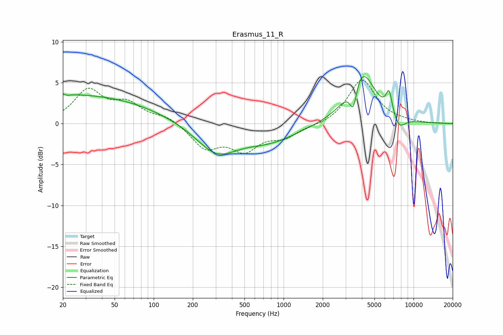

# Erasmus_11_R
See [usage instructions](https://github.com/jaakkopasanen/AutoEq#usage) for more options and info.

### Parametric EQs
Apply preamp of -5.8 dB when using parametric equalizer.

|   # | Type    |   Fc (Hz) |    Q |   Gain (dB) |
|-----|---------|-----------|------|-------------|
|   1 | Peaking |        21 | 5.84 |         2.9 |
|   2 | Peaking |        21 | 5.98 |        -2.9 |
|   3 | Peaking |        22 | 0.19 |         3.6 |
|   4 | Peaking |       307 | 0.89 |        -4.6 |
|   5 | Peaking |       311 | 0.87 |         1.1 |
|   6 | Peaking |       787 | 0.66 |        -1.9 |
|   7 | Peaking |      3440 | 4.91 |        -3.4 |
|   8 | Peaking |      3946 | 1.36 |         6.8 |
|   9 | Peaking |      6482 | 5.78 |         2.7 |
|  10 | Peaking |      7750 | 2.87 |        -1.5 |

### Fixed Band EQs
When using fixed band (also called graphic) equalizer, apply preamp of **-5.4 dB** (if available) and set gains manually with these parameters.

|   # | Type    |   Fc (Hz) |    Q |   Gain (dB) |
|-----|---------|-----------|------|-------------|
|   1 | Peaking |        31 | 1.41 |         3.9 |
|   2 | Peaking |        62 | 1.41 |         2.2 |
|   3 | Peaking |       125 | 1.41 |         0.9 |
|   4 | Peaking |       250 | 1.41 |        -2.9 |
|   5 | Peaking |       500 | 1.41 |        -2.9 |
|   6 | Peaking |      1000 | 1.41 |        -1.5 |
|   7 | Peaking |      2000 | 1.41 |        -0.3 |
|   8 | Peaking |      4000 | 1.41 |         5.4 |
|   9 | Peaking |      8000 | 1.41 |         0.1 |
|  10 | Peaking |     16000 | 1.41 |         0   |

### Graphs

