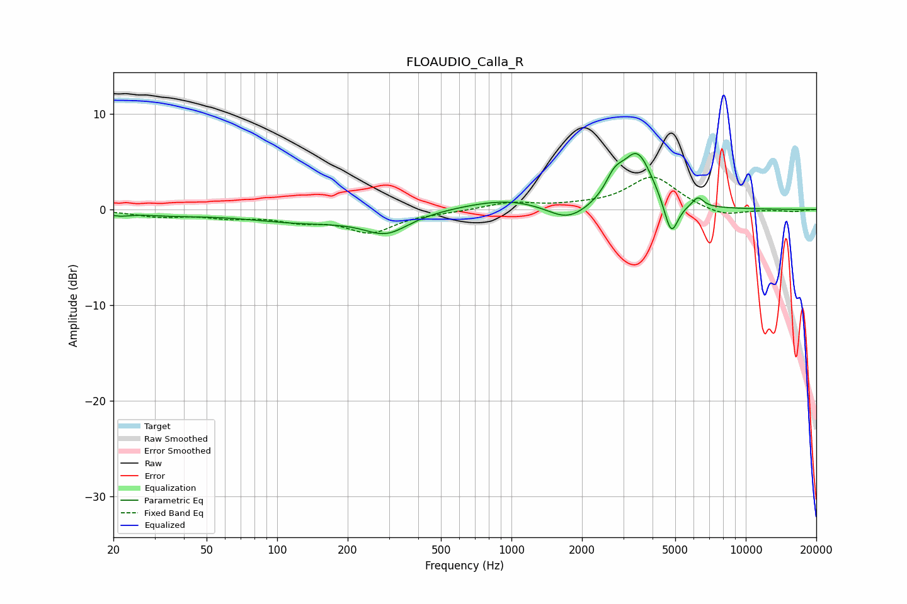

# FLOAUDIO_Calla_R
See [usage instructions](https://github.com/jaakkopasanen/AutoEq#usage) for more options and info.

### Parametric EQs
Apply preamp of -6.0 dB when using parametric equalizer.

|   # | Type    |   Fc (Hz) |    Q |   Gain (dB) |
|-----|---------|-----------|------|-------------|
|   1 | Peaking |        21 | 3.16 |        -0.4 |
|   2 | Peaking |        35 | 0.93 |        -0.4 |
|   3 | Peaking |       130 | 0.56 |        -1.2 |
|   4 | Peaking |       293 | 1.49 |        -2.1 |
|   5 | Peaking |       970 | 0.76 |         1.2 |
|   6 | Peaking |      1738 | 1.59 |        -1.8 |
|   7 | Peaking |      2750 | 3.71 |         1.9 |
|   8 | Peaking |      3446 | 2.1  |         5.8 |
|   9 | Peaking |      4804 | 4.59 |        -3.9 |
|  10 | Peaking |      6250 | 5.87 |         1   |

### Fixed Band EQs
When using fixed band (also called graphic) equalizer, apply preamp of **-3.5 dB** (if available) and set gains manually with these parameters.

|   # | Type    |   Fc (Hz) |    Q |   Gain (dB) |
|-----|---------|-----------|------|-------------|
|   1 | Peaking |        31 | 1.41 |        -0.7 |
|   2 | Peaking |        62 | 1.41 |        -0.7 |
|   3 | Peaking |       125 | 1.41 |        -1   |
|   4 | Peaking |       250 | 1.41 |        -2.3 |
|   5 | Peaking |       500 | 1.41 |        -0.2 |
|   6 | Peaking |      1000 | 1.41 |         0.7 |
|   7 | Peaking |      2000 | 1.41 |         0.3 |
|   8 | Peaking |      4000 | 1.41 |         3.4 |
|   9 | Peaking |      8000 | 1.41 |        -0.8 |
|  10 | Peaking |     16000 | 1.41 |        -0.2 |

### Graphs

