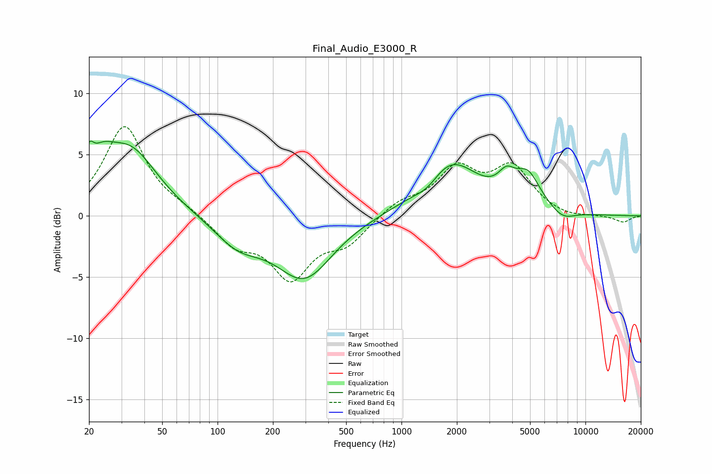

# Final_Audio_E3000_R
See [usage instructions](https://github.com/jaakkopasanen/AutoEq#usage) for more options and info.

### Parametric EQs
Apply preamp of -6.2 dB when using parametric equalizer.

|   # | Type    |   Fc (Hz) |    Q |   Gain (dB) |
|-----|---------|-----------|------|-------------|
|   1 | Peaking |        20 | 5.99 |         1.9 |
|   2 | Peaking |        23 | 2.08 |         2.1 |
|   3 | Peaking |        33 | 0.94 |         5.3 |
|   4 | Peaking |       129 | 1.08 |        -2.1 |
|   5 | Peaking |       296 | 0.92 |        -4.9 |
|   6 | Peaking |      1397 | 1.88 |        -1.2 |
|   7 | Peaking |      1808 | 0.9  |         4.7 |
|   8 | Peaking |      3726 | 3.01 |         1.6 |
|   9 | Peaking |      4863 | 2.02 |         2.7 |
|  10 | Peaking |      7524 | 2.06 |        -0.8 |

### Fixed Band EQs
When using fixed band (also called graphic) equalizer, apply preamp of **-7.4 dB** (if available) and set gains manually with these parameters.

|   # | Type    |   Fc (Hz) |    Q |   Gain (dB) |
|-----|---------|-----------|------|-------------|
|   1 | Peaking |        31 | 1.41 |         7.3 |
|   2 | Peaking |        62 | 1.41 |         0.4 |
|   3 | Peaking |       125 | 1.41 |        -2.2 |
|   4 | Peaking |       250 | 1.41 |        -4.8 |
|   5 | Peaking |       500 | 1.41 |        -2   |
|   6 | Peaking |      1000 | 1.41 |         1.1 |
|   7 | Peaking |      2000 | 1.41 |         3.6 |
|   8 | Peaking |      4000 | 1.41 |         3.7 |
|   9 | Peaking |      8000 | 1.41 |        -0.3 |
|  10 | Peaking |     16000 | 1.41 |        -0.5 |

### Graphs

