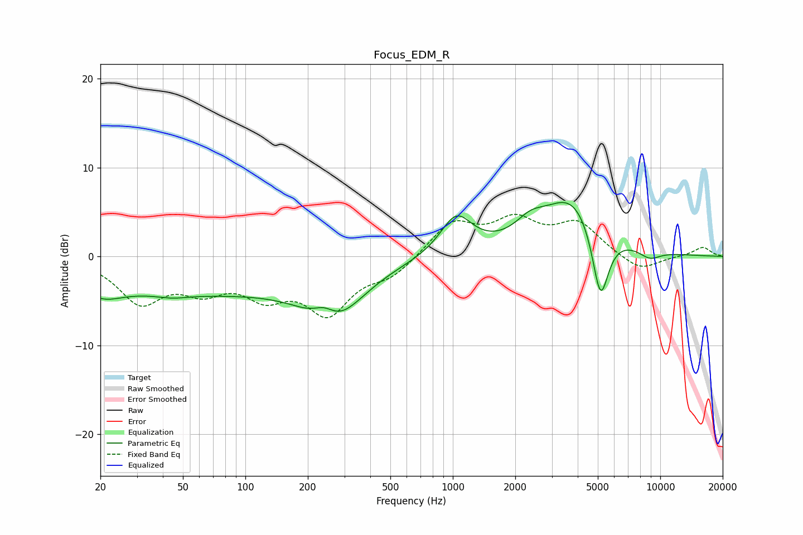

# Focus_EDM_R
See [usage instructions](https://github.com/jaakkopasanen/AutoEq#usage) for more options and info.

### Parametric EQs
Apply preamp of -6.2 dB when using parametric equalizer.

|   # | Type    |   Fc (Hz) |    Q |   Gain (dB) |
|-----|---------|-----------|------|-------------|
|   1 | Peaking |        20 | 1.46 |        -1.8 |
|   2 | Peaking |        44 | 1.97 |        -0.4 |
|   3 | Peaking |        55 | 0.25 |        -3.9 |
|   4 | Peaking |       241 | 2.53 |         1.8 |
|   5 | Peaking |       263 | 1    |        -5.9 |
|   6 | Peaking |      1039 | 1.84 |         4.4 |
|   7 | Peaking |      2360 | 2.01 |         1.7 |
|   8 | Peaking |      3808 | 0.95 |         6.8 |
|   9 | Peaking |      5148 | 3.34 |        -8.7 |
|  10 | Peaking |      8894 | 2.41 |        -1.1 |

### Fixed Band EQs
When using fixed band (also called graphic) equalizer, apply preamp of **-4.8 dB** (if available) and set gains manually with these parameters.

|   # | Type    |   Fc (Hz) |    Q |   Gain (dB) |
|-----|---------|-----------|------|-------------|
|   1 | Peaking |        31 | 1.41 |        -4.9 |
|   2 | Peaking |        62 | 1.41 |        -3   |
|   3 | Peaking |       125 | 1.41 |        -3.6 |
|   4 | Peaking |       250 | 1.41 |        -5.9 |
|   5 | Peaking |       500 | 1.41 |        -1.9 |
|   6 | Peaking |      1000 | 1.41 |         3.8 |
|   7 | Peaking |      2000 | 1.41 |         3.6 |
|   8 | Peaking |      4000 | 1.41 |         3.5 |
|   9 | Peaking |      8000 | 1.41 |        -1.8 |
|  10 | Peaking |     16000 | 1.41 |         1.1 |

### Graphs

